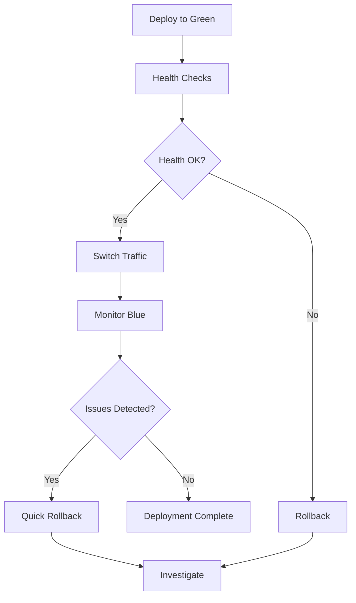

# Blue-Green Deployment Architecture

This document describes the blue-green deployment strategy implemented in the Jenkins HA infrastructure, providing zero-downtime deployments and multi-team support.

## Table of Contents

- [Overview](#overview)
- [Architecture Components](#architecture-components)
- [Deployment Strategy](#deployment-strategy)
- [Multi-Team Configuration](#multi-team-configuration)
- [Traffic Routing](#traffic-routing)
- [Environment Switching](#environment-switching)
- [Monitoring and Health Checks](#monitoring-and-health-checks)
- [Troubleshooting](#troubleshooting)

## Overview

The blue-green deployment strategy maintains two identical production environments:
- **Blue Environment**: Currently active production environment
- **Green Environment**: Standby environment for staging new deployments

### Key Benefits

- **Zero Downtime**: Seamless switching between environments
- **Risk Mitigation**: Easy rollback if issues are detected
- **Testing in Production**: Validate changes in production-like environment
- **Multi-Team Isolation**: Separate blue-green environments per team

## Architecture Components

### HAProxy Load Balancer

```yaml
# HAProxy Configuration Structure
Frontend:
  - DevOps Team Frontend (Port 8080)
  - Developer Team Frontend (Port 8090)  
  - QA Team Frontend (Port 8100)
  - Statistics Interface (Port 8404)
  - Management API (Port 8405)

Backend:
  - Blue Environment Backends
  - Green Environment Backends
  - Health Check Endpoints
```

### Container Architecture

Each team has dedicated blue-green container pairs:

```
Team: DevOps
├── jenkins-devops-blue (Active)
│   ├── Port: 8080 (External)
│   ├── Agent Port: 50000
│   └── Health Check: /login
├── jenkins-devops-green (Standby)
│   ├── Port: 8081 (Internal)
│   ├── Agent Port: 50001
│   └── Health Check: /login
└── Shared Volumes
    ├── jenkins-devops-data
    ├── jenkins-devops-plugins
    └── jenkins-devops-cache
```

## Deployment Strategy

### Blue-Green Deployment Flow



### Deployment Steps

1. **Preparation**
   ```bash
   # Backup current configuration
   ./scripts/backup.sh pre-deployment
   
   # Validate green environment
   ./scripts/blue-green-healthcheck.sh validate green
   ```

2. **Deploy to Green**
   ```bash
   # Deploy new version to green environment
   ansible-playbook ansible/site.yml \
     -e deployment_target=green \
     -e jenkins_image_tag=new-version
   ```

3. **Health Validation**
   ```bash
   # Comprehensive health checks
   ./scripts/blue-green-healthcheck.sh full green
   
   # Smoke tests
   ./scripts/smoke-tests.sh green
   ```

4. **Traffic Switch**
   ```bash
   # Switch HAProxy configuration
   ./scripts/blue-green-switch.sh green
   
   # Verify traffic routing
   curl -H "Host: jenkins.company.com" http://load-balancer:8080/api/json
   ```

5. **Post-Deployment Monitoring**
   ```bash
   # Monitor for 15 minutes
   ./scripts/post-deployment-monitor.sh 15m
   ```

## Multi-Team Configuration

### Team Configuration Structure

```yaml
# ansible/group_vars/all/jenkins.yml
jenkins_teams:
  - name: "devops"
    port: 8080
    agent_port: 50000
    memory: "4g"
    cpu_limit: "2.0"
    active_environment: "blue"
    
  - name: "developer"
    port: 8090
    agent_port: 50010
    memory: "3g"
    cpu_limit: "1.5"
    active_environment: "blue"
    
  - name: "qa"
    port: 8100
    agent_port: 50020
    memory: "2g"
    cpu_limit: "1.0"
    active_environment: "blue"
```

### Team-Specific Deployments

Each team can independently manage their blue-green deployments:

```bash
# Deploy only DevOps team environment
ansible-playbook ansible/site.yml \
  -e jenkins_team_filter=devops \
  -e deployment_target=green

# Switch only QA team traffic
./scripts/blue-green-switch.sh green qa

# Rollback Developer team
./scripts/blue-green-switch.sh blue developer
```

## Traffic Routing

### HAProxy Configuration

```haproxy
# DevOps Team Frontend
frontend devops_frontend
    bind *:8080
    default_backend devops_blue
    
    # Blue-Green switching via stats socket
    stats bind *:8404
    stats uri /haproxy-stats
    stats admin if TRUE

# DevOps Blue Backend
backend devops_blue
    balance roundrobin
    option httpchk GET /login
    server devops-blue jenkins-host:8080 check
    
# DevOps Green Backend  
backend devops_green
    balance roundrobin
    option httpchk GET /login
    server devops-green jenkins-host:8081 check
```

### Dynamic Backend Switching

```bash
# Switch DevOps team from blue to green
echo "set server devops_blue/devops-blue state maint" | \
  socat stdio /var/lib/haproxy/stats

echo "set server devops_green/devops-green state ready" | \
  socat stdio /var/lib/haproxy/stats

# Update frontend default backend
echo "set frontend devops_frontend default_backend devops_green" | \
  socat stdio /var/lib/haproxy/stats
```

## Environment Switching

### Automated Switching Script

The `jenkins-blue-green-switch.sh` script handles environment switching:

```bash
#!/bin/bash
# Usage: ./scripts/blue-green-switch.sh <target_environment> [team]

TARGET_ENV=$1
TEAM=${2:-all}

# Pre-switch validation
validate_target_environment() {
    local env=$1
    local team=$2
    
    # Health check target environment
    if ! ./scripts/blue-green-healthcheck.sh $env $team; then
        echo "ERROR: Target environment $env failed health checks"
        exit 1
    fi
}

# Execute switch
switch_traffic() {
    local env=$1
    local team=$2
    
    # Update HAProxy configuration
    if [[ $team == "all" ]]; then
        # Switch all teams
        for team_name in devops developer qa; do
            switch_team_traffic $env $team_name
        done
    else
        switch_team_traffic $env $team
    fi
}

# Verify switch success
verify_switch() {
    local env=$1
    local team=$2
    
    # Wait for traffic to stabilize
    sleep 30
    
    # Verify routing
    if ! ./scripts/verify-routing.sh $env $team; then
        echo "ERROR: Traffic routing verification failed"
        # Automatic rollback
        rollback_switch $env $team
        exit 1
    fi
}
```

### Manual Switch via HAProxy Stats

Access HAProxy stats interface at `http://load-balancer:8404/stats`:

1. Navigate to the relevant backend
2. Set current backend servers to "MAINT" mode
3. Set target backend servers to "READY" mode
4. Update frontend default backend

## Monitoring and Health Checks

### Health Check Endpoints

Each Jenkins environment exposes health check endpoints:

```bash
# Basic availability check
GET /login HTTP/1.1
Expected: 200 OK

# API availability check  
GET /api/json HTTP/1.1
Expected: 200 OK with valid JSON

# Queue status check
GET /queue/api/json HTTP/1.1
Expected: 200 OK

# Agent status check
GET /computer/api/json HTTP/1.1
Expected: 200 OK
```

### Comprehensive Health Validation

```bash
#!/bin/bash
# Health check script: scripts/blue-green-healthcheck.sh

check_jenkins_api() {
    local url=$1
    local response=$(curl -s -w "%{http_code}" -o /dev/null $url/api/json)
    
    if [[ $response == "200" ]]; then
        echo "✅ Jenkins API accessible"
        return 0
    else
        echo "❌ Jenkins API failed (HTTP $response)"
        return 1
    fi
}

check_plugin_health() {
    local url=$1
    local plugin_count=$(curl -s $url/pluginManager/api/json | jq '.plugins | length')
    
    if [[ $plugin_count -gt 0 ]]; then
        echo "✅ Plugins loaded ($plugin_count plugins)"
        return 0
    else
        echo "❌ Plugin loading failed"
        return 1
    fi
}

check_agent_connectivity() {
    local url=$1
    local online_agents=$(curl -s $url/computer/api/json | jq '[.computer[] | select(.offline == false)] | length')
    
    echo "ℹ️  Online agents: $online_agents"
    return 0
}
```

### Monitoring Integration

Prometheus metrics for blue-green deployment:

```yaml
# Blue-Green specific metrics
jenkins_blue_green_active_environment{team="devops"} 1
jenkins_blue_green_switch_timestamp{team="devops"} 1640995200
jenkins_blue_green_health_status{team="devops",environment="blue"} 1
jenkins_blue_green_health_status{team="devops",environment="green"} 1
```

Grafana dashboard panels:
- Active environment per team
- Switch history timeline
- Health status indicators
- Traffic distribution metrics

## Troubleshooting

### Common Issues

#### 1. Health Check Failures

```bash
# Symptom: Green environment fails health checks
# Diagnosis:
./scripts/blue-green-healthcheck.sh green devops

# Resolution:
# Check container logs
docker logs jenkins-devops-green

# Validate configuration
docker exec jenkins-devops-green cat /var/jenkins_home/jenkins.yaml

# Restart if necessary
docker restart jenkins-devops-green
```

#### 2. Traffic Not Switching

```bash
# Symptom: HAProxy still routing to old environment
# Diagnosis:
curl -H "Host: jenkins.company.com" http://load-balancer:8404/stats

# Resolution:
# Manual backend switch
echo "set frontend devops_frontend default_backend devops_green" | \
  socat stdio /var/lib/haproxy/stats

# Verify switch
./scripts/verify-routing.sh green devops
```

#### 3. Session Persistence Issues

```bash
# Symptom: Users lose sessions during switch
# Resolution: Update HAProxy configuration
# Add session stickiness:
backend devops_green
    balance roundrobin
    cookie JSESSIONID prefix nocache
    server devops-green jenkins-host:8081 check cookie green
```

#### 4. Rollback Scenarios

```bash
# Quick rollback to blue environment
./scripts/blue-green-switch.sh blue devops

# Emergency rollback with container restart
./scripts/emergency-rollback.sh devops

# Full disaster recovery
./scripts/disaster-recovery.sh restore-from-backup
```

### Debugging Commands

```bash
# Check container status
docker ps | grep jenkins

# View HAProxy stats
curl http://load-balancer:8404/stats

# Test connectivity
nc -zv jenkins-host 8080
nc -zv jenkins-host 8081

# Check DNS resolution
nslookup jenkins.company.com

# Validate SSL certificates
openssl s_client -connect jenkins.company.com:443

# Check shared storage
df -h /shared/jenkins
ls -la /shared/jenkins/
```

## Best Practices

### Deployment Best Practices

1. **Always run health checks** before switching traffic
2. **Monitor for 15-30 minutes** after deployment
3. **Keep blue environment running** until green is proven stable
4. **Maintain synchronized shared data** between environments
5. **Test rollback procedures** regularly

### Operational Best Practices

1. **Schedule deployments** during low-traffic periods
2. **Coordinate team deployments** to avoid conflicts
3. **Maintain deployment logs** for audit trails
4. **Practice disaster recovery** scenarios quarterly
5. **Update documentation** after configuration changes

### Security Considerations

1. **Secure HAProxy stats interface** with authentication
2. **Restrict management API access** to authorized users
3. **Monitor for configuration drift** between environments
4. **Encrypt inter-container communication** where possible
5. **Regular security scans** of container images

---

For additional information, see:
- [HAProxy Configuration](docs/config/HAPROXY-CONFIGURATION.md)
- [Container Management](docs/CONTAINER-MANAGEMENT.md)
- [Monitoring Setup](docs/MONITORING.md)
- [Disaster Recovery](docs/BACKUP-RECOVERY.md)