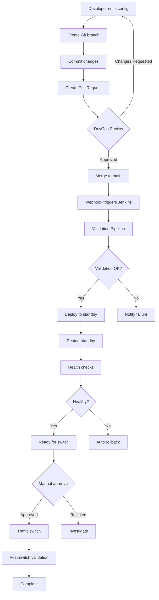

# Dynamic Jenkins Configuration Update System

Complete guide for self-service Jenkins configuration updates with zero-downtime deployment.

## Table of Contents

- [Overview](#overview)
- [Architecture](#architecture)
- [Quick Start](#quick-start)
- [Workflow](#workflow)
- [Components](#components)
- [Usage Examples](#usage-examples)
- [Troubleshooting](#troubleshooting)
- [Best Practices](#best-practices)

---

## Overview

### What This System Provides

✅ **Self-Service Configuration Updates** - Teams can update their Jenkins config via Git PR
✅ **Zero-Downtime Deployment** - Blue-green deployment ensures no service interruption
✅ **Comprehensive Validation** - YAML, JCasC schema, and dry-run tests before deployment
✅ **Automatic Rollback** - Failed deployments automatically roll back to previous config
✅ **Audit Trail** - All changes tracked in Git with PR approval workflow
✅ **Notifications** - Slack, Teams, Email, and Grafana annotations support

### Key Benefits

- **No custom Docker image rebuilds** - Config is external and hot-reloadable
- **No Ansible knowledge required** - Edit YAML files, create PR, done
- **GitOps workflow** - Infrastructure as Code principles
- **Safe deployments** - Deploy to standby, validate, then switch traffic

---

## Architecture

### System Components

```
┌──────────────────────────────────────────────────────────┐
│  Git Repository (jenkins-ha)                             │
│                                                           │
│  jenkins-configs/                                        │
│    ├── devops.yml        ← Teams edit these files       │
│    ├── developer.yml                                     │
│    └── README.md                                         │
└────────────────┬─────────────────────────────────────────┘
                 │
                 │ (PR merged to main)
                 ↓
┌──────────────────────────────────────────────────────────┐
│  Webhook Trigger                                         │
│  → Jenkins Job: "Update Team Configuration"             │
└────────────────┬─────────────────────────────────────────┘
                 │
                 ↓
┌──────────────────────────────────────────────────────────┐
│  Validation Pipeline                                     │
│  1. YAML Syntax Check                                    │
│  2. JCasC Schema Validation                              │
│  3. Dry-run Test (temp container)                        │
└────────────────┬─────────────────────────────────────────┘
                 │
                 ↓
┌──────────────────────────────────────────────────────────┐
│  Deployment to Standby                                   │
│  1. Determine standby (blue or green)                    │
│  2. Copy config to standby casc_configs/                 │
│  3. Restart standby Jenkins container                    │
│  4. Health check validation (5 min)                      │
└────────────────┬─────────────────────────────────────────┘
                 │
                 ↓ (Manual or Automatic)
┌──────────────────────────────────────────────────────────┐
│  Traffic Switch                                          │
│  Blue-green switch script (zero-downtime)                │
│  Active ←→ Standby                                      │
└──────────────────────────────────────────────────────────┘
```

### File Locations

**Configuration Files** (Edit these):
```
jenkins-configs/
├── devops.yml         # DevOps team config
├── developer.yml      # Developer team config
└── README.md          # Usage guide
```

**Validation Scripts** (Automatic):
```
scripts/config-validation/
├── validate-yaml-syntax.sh      # YAML syntax check
├── validate-jcasc-schema.sh     # JCasC schema validation
├── dry-run-test.sh              # Dry-run in temp container
└── validate-config.sh           # Master validation script
```

**Deployment Scripts** (Automatic):
```
scripts/
├── deploy-team-config.sh        # Deploy config to standby
└── notify-config-change.sh      # Send notifications
```

**Jenkins Pipeline**:
```
pipelines/Jenkinsfile.config-update  # Self-service pipeline
```

**Runtime Locations** (Generated):
```
/var/jenkins/<team>/blue/casc_configs/jenkins.yaml   # Blue environment config
/var/jenkins/<team>/green/casc_configs/jenkins.yaml  # Green environment config
/var/jenkins/<team>/blue-green-state.json            # Current state
```

---

## Quick Start

### For Developer Teams (Making Changes)

```bash
# 1. Clone repository
git clone https://github.com/your-org/jenkins-ha.git
cd jenkins-ha

# 2. Create feature branch
git checkout -b update-developer-agent-memory

# 3. Edit your team's config
vi jenkins-configs/developer.yml
# Change: memoryLimit: 1073741824 → 2147483648 (1GB → 2GB)

# 4. Validate locally (optional but recommended)
./scripts/config-validation/validate-config.sh jenkins-configs/developer.yml

# 5. Commit and push
git add jenkins-configs/developer.yml
git commit -m "Increase Python agent memory to 2GB"
git push origin update-developer-agent-memory

# 6. Create Pull Request in GitHub/GitLab
# DevOps team will review and approve

# 7. After merge:
#    - Webhook triggers Jenkins job automatically
#    - Config deployed to standby
#    - Validated
#    - Ready for switch
```

### For DevOps Team (Approving Changes)

```bash
# 1. Review PR
# Check: YAML syntax, security implications, resource limits

# 2. Approve and merge PR

# 3. Monitor Jenkins job: "Update Team Configuration"
# Jenkins UI → Build → Update-Team-Configuration

# 4. Verify standby is healthy
# Access standby Jenkins UI:
# - If blue is active: http://jenkins-host:8090 (green port)
# - If green is active: http://jenkins-host:8080 (blue port)

# 5. Manual traffic switch (when ready)
/var/jenkins/scripts/blue-green-switch-devops.sh

# Or trigger via Jenkins job: "Blue-Green Switch"
```

---

## Workflow

### Complete Workflow Diagram



### Detailed Steps

#### Step 1: Configuration Edit (Developer Team)
```yaml
# Edit jenkins-configs/devops.yml
- labelString: "devops-maven maven build"
  instanceCapStr: "10"  # Change from 5 to 10
  memoryLimit: 2147483648  # Change from 1GB to 2GB
```

#### Step 2: Pull Request (Developer Team)
- Create feature branch
- Commit changes
- Push to remote
- Create PR with description of changes

#### Step 3: Review & Approval (DevOps Team)
- Review changes in PR
- Check for:
  - Valid YAML syntax
  - Reasonable resource limits
  - No security issues (hardcoded passwords, etc.)
  - Proper use of environment variables
- Approve or request changes
- Merge to main when approved

#### Step 4: Automatic Deployment (Jenkins Pipeline)

**Validation Phase** (2-5 minutes):
```bash
1. YAML syntax validation
2. JCasC schema validation
3. Dry-run test in temporary container
```

**Deployment Phase** (5-10 minutes):
```bash
1. Determine standby environment (read blue-green-state.json)
2. Backup existing config
3. Copy new config to standby casc_configs/
4. Restart standby Jenkins container
5. Wait for startup (30 seconds)
```

**Validation Phase** (5 minutes):
```bash
1. Container health check
2. Jenkins API accessibility
3. Plugin loading status
4. Agent provisioning test
```

#### Step 5: Manual Switch (DevOps Team)

**Validate Standby**:
```bash
# Access standby Jenkins UI
# Test agent provisioning
# Run a test build
# Check logs for errors
```

**Switch Traffic** (zero-downtime):
```bash
/var/jenkins/scripts/blue-green-switch-devops.sh
```

**Monitor**:
```bash
# Watch logs
docker logs -f jenkins-devops-blue  # (now standby)

# Access new active UI
http://jenkins-host:8080  # (now green)
```

---

## Components

### 1. Configuration Files

**jenkins-configs/devops.yml**:
```yaml
jenkins:
  systemMessage: "DevOps Team Jenkins"
  clouds:
    - docker:
        templates:
          - labelString: "devops-maven"
            instanceCapStr: "10"
            memoryLimit: 2147483648
```

**What you can change**:
- Agent instance caps
- Memory/CPU limits
- Agent labels
- Environment variables
- Job DSL scripts

**What NOT to change**:
- Security settings (requires DevOps approval)
- Docker socket paths
- Network names
- Core Jenkins settings

### 2. Validation Scripts

**validate-yaml-syntax.sh**:
- Uses Python, yamllint, yq
- Checks for tabs, special characters
- Validates YAML structure

**validate-jcasc-schema.sh**:
- Validates JCasC structure
- Checks required keys
- Detects hardcoded passwords
- Optional live Jenkins validation

**dry-run-test.sh**:
- Starts temporary Jenkins container
- Mounts new config
- Validates startup
- Auto-cleanup after test

**validate-config.sh** (Master):
- Runs all validations
- Comprehensive reporting
- Can skip dry-run for speed

### 3. Deployment Scripts

**deploy-team-config.sh**:
```bash
# Usage
./scripts/deploy-team-config.sh \
  --team devops \
  --config jenkins-configs/devops.yml \
  --restart \
  --validate
```

Features:
- Auto-detects standby environment
- Backs up existing config (keeps last 10)
- Sets proper permissions
- Optional restart
- Optional health checks

**notify-config-change.sh**:
```bash
# Usage
./scripts/notify-config-change.sh \
  --team devops \
  --message "Config deployed to standby" \
  --severity info \
  --channel all
```

Supports:
- Slack webhooks
- Microsoft Teams
- Email
- Grafana annotations

### 4. Jenkins Pipeline

**Jenkinsfile.config-update**:

Parameters:
- `TEAM_NAME`: Select team
- `GIT_BRANCH`: Source branch
- `SKIP_DRY_RUN`: Skip dry-run (faster)
- `AUTO_SWITCH`: Auto-switch traffic
- `REQUIRE_APPROVAL`: Manual approval gate
- `NOTIFICATION_CHANNEL`: Notification method

Stages:
1. Checkout
2. Pre-flight Checks
3. Validation (parallel)
4. Dry-run Test
5. Determine Standby
6. Deploy to Standby
7. Restart Container
8. Health Check
9. Approval Gate (optional)
10. Traffic Switch (optional)
11. Post-Switch Validation

---

## Usage Examples

### Example 1: Update Agent Memory

```bash
# Edit config
vi jenkins-configs/devops.yml

# Change
memoryLimit: 1073741824  # 1GB
# To
memoryLimit: 2147483648  # 2GB

# Commit
git add jenkins-configs/devops.yml
git commit -m "Increase maven agent memory to 2GB"

# Push and create PR
git push origin feature/increase-memory
```

### Example 2: Add New Agent Template

```yaml
# Add to jenkins-configs/devops.yml
- labelString: "devops-golang golang go"
  dockerTemplateBase:
    image: "jenkins/golang-agent:latest"
    network: "jenkins-network"
    memoryLimit: 1073741824
  instanceCapStr: "5"
  retentionStrategy:
    idleMinutes: 10
```

### Example 3: Update System Message

```yaml
# Edit jenkins-configs/devops.yml
systemMessage: |
  DevOps Team Jenkins - Production
  Contact: devops-team@company.com
  Slack: #devops-jenkins
```

### Example 4: Add Environment Variable

```yaml
# Edit jenkins-configs/devops.yml
globalNodeProperties:
  - envVars:
      env:
        - key: "CUSTOM_VAR"
          value: "custom_value"
        - key: "API_ENDPOINT"
          value: "https://api.company.com"
```

### Example 5: Manual Deployment (DevOps Only)

```bash
# Validate config
./scripts/config-validation/validate-config.sh jenkins-configs/devops.yml

# Deploy to standby
./scripts/deploy-team-config.sh \
  --team devops \
  --config jenkins-configs/devops.yml \
  --restart \
  --validate

# Manual switch
/var/jenkins/scripts/blue-green-switch-devops.sh
```

---

## Troubleshooting

### Validation Failures

**YAML Syntax Error**:
```bash
# Test locally
./scripts/config-validation/validate-yaml-syntax.sh jenkins-configs/devops.yml

# Common issues:
# - Tabs instead of spaces
# - Unclosed quotes
# - Incorrect indentation
```

**JCasC Schema Error**:
```bash
# Test locally
./scripts/config-validation/validate-jcasc-schema.sh jenkins-configs/devops.yml

# Common issues:
# - Missing required fields
# - Invalid plugin configuration
# - Hardcoded passwords
```

**Dry-run Test Failure**:
```bash
# Run with --keep-container to debug
./scripts/config-validation/dry-run-test.sh \
  jenkins-configs/devops.yml \
  --keep-container

# Access test container
docker exec -it jenkins-dryrun-test-<timestamp> bash

# View Jenkins logs
docker logs jenkins-dryrun-test-<timestamp>
```

### Deployment Failures

**Container Won't Start**:
```bash
# Check container logs
docker logs jenkins-devops-green

# Common issues:
# - Invalid JCasC config
# - Port conflicts
# - Missing environment variables
# - Plugin compatibility
```

**Health Check Failure**:
```bash
# Manual health check
/var/jenkins/scripts/blue-green-healthcheck-devops.sh green

# Check Jenkins is accessible
PORT=$(docker port jenkins-devops-green 8080 | cut -d: -f2)
curl http://localhost:$PORT/api/json

# View startup logs
docker exec jenkins-devops-green cat /var/jenkins_home/logs/jenkins.log
```

**Config Not Applied**:
```bash
# Verify config file exists
docker exec jenkins-devops-green ls -la /var/jenkins_home/casc_configs/

# Verify JCasC plugin loaded
docker logs jenkins-devops-green | grep "Configuration as Code"

# Force reload (if Jenkins already running)
docker exec jenkins-devops-green \
  curl -X POST http://localhost:8080/reload-jcasc-configuration
```

### Rollback Procedures

**Automatic Rollback** (Pipeline handles this):
```bash
# If health checks fail, pipeline automatically:
# 1. Restores previous config from backup
# 2. Restarts container
# 3. Notifies team
```

**Manual Rollback**:
```bash
# Option 1: Restore from backup
CONFIG_DIR="/var/jenkins/devops/green/casc_configs"
BACKUP=$(ls -t ${CONFIG_DIR}/jenkins.yaml.backup.* | head -1)
cp $BACKUP ${CONFIG_DIR}/jenkins.yaml
docker restart jenkins-devops-green

# Option 2: Switch back to previous environment
/var/jenkins/scripts/blue-green-switch-devops.sh

# Option 3: Git revert
git revert <commit-hash>
git push origin main
# Triggers re-deployment with old config
```

---

## Best Practices

### For Developer Teams

1. **Test Locally First**:
   ```bash
   ./scripts/config-validation/validate-config.sh jenkins-configs/developer.yml
   ```

2. **Small, Incremental Changes**:
   - One change per PR
   - Easier to review
   - Easier to rollback

3. **Clear Commit Messages**:
   ```
   Good: "Increase Python agent memory from 1GB to 2GB"
   Bad: "Update config"
   ```

4. **Use Environment Variables**:
   ```yaml
   # Good
   password: "${MY_PASSWORD}"

   # Bad
   password: "actual-password-here"
   ```

5. **Document Changes in PR**:
   - What changed
   - Why changed
   - Expected impact

### For DevOps Team

1. **Review Thoroughly**:
   - Check resource limits are reasonable
   - Verify no hardcoded secrets
   - Ensure proper syntax

2. **Validate in Standby First**:
   - Access standby Jenkins UI
   - Run test builds
   - Check logs

3. **Schedule Switches Carefully**:
   - Avoid peak hours
   - Coordinate with teams
   - Monitor after switch

4. **Monitor Post-Switch**:
   ```bash
   # Watch for 10-15 minutes
   docker logs -f jenkins-devops-blue

   # Check metrics
   curl http://localhost:8080/prometheus
   ```

5. **Keep Backups**:
   - Configs are automatically backed up
   - Keep last 10 versions
   - Test restore procedures

### Security Best Practices

1. **Never Commit Secrets**:
   ```yaml
   # Always use environment variable substitution
   password: "${JENKINS_ADMIN_PASSWORD}"
   ```

2. **Limit Security Changes**:
   - Security settings require DevOps approval
   - Don't modify `securityRealm` or `authorizationStrategy`

3. **Review Plugins Carefully**:
   - Plugin changes require image rebuild
   - Security implications

4. **Audit Trail**:
   - All changes in Git history
   - PR approval records
   - Jenkins build logs

---

## Summary

### What We've Built

✅ Self-service Jenkins configuration updates
✅ Zero-downtime deployment via blue-green
✅ Comprehensive validation (YAML, schema, dry-run)
✅ Automatic rollback on failure
✅ Git-based audit trail
✅ Multi-channel notifications

### Workflow Recap

```
1. Developer edits config file
2. Creates Pull Request
3. DevOps team approves
4. Jenkins pipeline auto-deploys to standby
5. Validates health
6. DevOps manually switches traffic (zero-downtime)
7. Done!
```

### Key Files to Know

- **Edit**: `jenkins-configs/{team}.yml`
- **Validate**: `scripts/config-validation/validate-config.sh`
- **Deploy**: Automatic via Jenkins pipeline
- **Switch**: `/var/jenkins/scripts/blue-green-switch-{team}.sh`

### Getting Help

- **Config Questions**: See `jenkins-configs/README.md`
- **Pipeline Issues**: Check Jenkins console output
- **Validation Errors**: Run validation scripts locally
- **Rollback**: See troubleshooting section above

---

**Last Updated**: 2025-01-08
**Maintained By**: Core Automation Team
