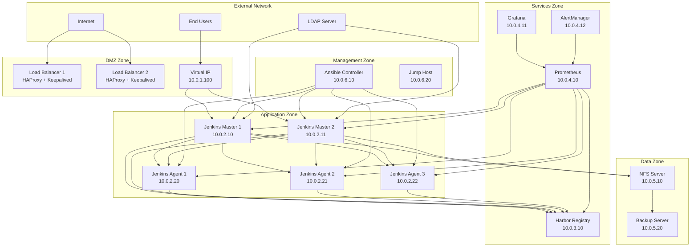

# Network Architecture Documentation

## Overview

This document describes the network architecture, security zones, communication flows, and networking requirements for the Jenkins HA infrastructure. The network design implements defense-in-depth principles with proper segmentation and access controls.

## Network Topology

### High-Level Network Architecture



### Network Segmentation

| Zone | VLAN | Subnet | Purpose | Security Level |
|------|------|---------|---------|----------------|
| **DMZ** | 100 | 10.0.1.0/24 | Load Balancers, Reverse Proxies | High |
| **Application** | 200 | 10.0.2.0/24 | Jenkins Masters and Agents | High |
| **Services** | 300 | 10.0.3.0/24 | Harbor Registry | Medium |
| **Monitoring** | 400 | 10.0.4.0/24 | Prometheus, Grafana, AlertManager | Medium |
| **Data** | 500 | 10.0.5.0/24 | NFS, Backup Storage | High |
| **Management** | 600 | 10.0.6.0/24 | Ansible, Jump Hosts | Critical |

## Detailed Component Network Configuration

### Load Balancer Configuration

**HAProxy Load Balancers:**
- **Primary LB**: 10.0.1.10
- **Secondary LB**: 10.0.1.11
- **Virtual IP (VIP)**: 10.0.1.100
- **Health Check**: HTTP GET /login every 5 seconds
- **Session Persistence**: Source IP based
- **SSL Termination**: Yes (with backend re-encryption)

```yaml
# HAProxy Backend Configuration
backend jenkins_masters
  balance roundrobin
  option httpchk GET /login
  server jenkins-master-1 10.0.2.10:8080 check
  server jenkins-master-2 10.0.2.11:8080 check backup
```

**Keepalived Configuration:**
- **VRRP Instance**: Jenkins_HA
- **Virtual Router ID**: 50
- **Priority**: Primary=100, Secondary=90
- **Advertisement Interval**: 1 second
- **Authentication**: AH with shared secret

### Jenkins Masters Network Configuration

**Network Settings:**
- **Interface**: eth0 (Application Zone)
- **IP Range**: 10.0.2.10-10.0.2.20
- **Gateway**: 10.0.2.1
- **DNS**: 10.0.6.50, 8.8.8.8
- **MTU**: 1500

**Port Configuration:**
| Service | Port | Protocol | Access |
|---------|------|----------|--------|
| Jenkins UI | 8080 | HTTP | Internal |
| Jenkins HTTPS | 8443 | HTTPS | Load Balancer |
| Jenkins Agent | 50000 | TCP | Agents Only |
| SSH | 22 | TCP | Management Zone |
| SNMP | 161 | UDP | Monitoring Zone |

**Container Networking:**
- **Bridge Network**: jenkins-network (172.20.0.0/16)
- **DNS Resolution**: Custom DNS for service discovery
- **Port Mapping**: Host ports to container ports
- **Network Policies**: Container-to-container communication allowed

### Jenkins Agents Network Configuration

**Agent Types and Network:**
| Agent Type | IP Range | Specialized Ports |
|------------|----------|-------------------|
| Maven Agents | 10.0.2.20-10.0.2.29 | 8080 (Maven daemon) |
| Docker-in-Docker | 10.0.2.30-10.0.2.39 | 2376 (Docker daemon) |
| Python Agents | 10.0.2.40-10.0.2.49 | 8000 (Python web server) |
| Node.js Agents | 10.0.2.50-10.0.2.59 | 3000 (Node.js app) |

**Agent Connectivity:**
- **Outbound**: Harbor Registry (10.0.3.10:443, 10.0.3.10:80)
- **Outbound**: Internet (package downloads, git repositories)
- **Inbound**: Jenkins Masters (connection initiation)
- **Inbound**: Monitoring (Prometheus scraping)

### Harbor Registry Network Configuration

**Harbor Services:**
- **Core API**: 10.0.3.10:80, 10.0.3.10:443
- **Registry**: 10.0.3.10:5000
- **Notary**: 10.0.3.10:4443
- **Database**: 10.0.3.10:5432 (internal)
- **Redis**: 10.0.3.10:6379 (internal)

**Network Access Patterns:**
- **Pull Access**: All Jenkins components
- **Push Access**: Jenkins Masters only
- **Admin Access**: Management Zone only
- **Replication**: External Harbor instances (if configured)

### Monitoring Network Configuration

**Prometheus Configuration:**
- **Server**: 10.0.4.10:9090
- **Targets**: All infrastructure components
- **Scrape Interval**: 15 seconds
- **Retention**: 30 days

**Metrics Collection Sources:**
| Component | Endpoint | Port | Metrics |
|-----------|----------|------|---------|
| Jenkins Masters | /prometheus | 8080 | Application metrics |
| Jenkins Agents | /metrics | 9100 | Node exporter |
| HAProxy | /stats | 8404 | Load balancer stats |
| Harbor | /api/v2.0/metrics | 443 | Registry metrics |
| Docker | /metrics | 9323 | Container metrics |

**Grafana Configuration:**
- **Server**: 10.0.4.11:3000
- **Data Sources**: Prometheus (10.0.4.10:9090)
- **Authentication**: LDAP integration
- **Dashboards**: Custom Jenkins HA dashboards

### Shared Storage Network Configuration

**NFS Server Configuration:**
- **Server**: 10.0.5.10
- **Exports**: `/jenkins_home`, `/backup`, `/artifacts`
- **NFS Version**: NFSv4.1
- **Security**: Kerberos authentication
- **Performance**: async, rsize=1048576, wsize=1048576

**Mount Points:**
```bash
# Jenkins Masters
10.0.5.10:/jenkins_home /opt/jenkins_home nfs4 defaults,hard,intr 0 0
10.0.5.10:/artifacts /opt/artifacts nfs4 defaults,hard,intr 0 0

# Backup Access
10.0.5.10:/backup /backup nfs4 defaults,hard,intr 0 0
```

## Network Security

### Firewall Rules

**DMZ Zone (Load Balancers):**
```bash
# Inbound Rules
iptables -A INPUT -p tcp --dport 80 -s 0.0.0.0/0 -j ACCEPT
iptables -A INPUT -p tcp --dport 443 -s 0.0.0.0/0 -j ACCEPT
iptables -A INPUT -p tcp --dport 8404 -s 10.0.6.0/24 -j ACCEPT  # Stats page
iptables -A INPUT -p vrrp -s 10.0.1.0/24 -j ACCEPT  # VRRP traffic

# Outbound Rules
iptables -A OUTPUT -p tcp --dport 8080 -d 10.0.2.0/24 -j ACCEPT  # Jenkins backends
iptables -A OUTPUT -p tcp --dport 8443 -d 10.0.2.0/24 -j ACCEPT  # Jenkins SSL
```

**Application Zone (Jenkins):**
```bash
# Inbound Rules
iptables -A INPUT -p tcp --dport 8080 -s 10.0.1.0/24 -j ACCEPT  # Load balancers
iptables -A INPUT -p tcp --dport 8443 -s 10.0.1.0/24 -j ACCEPT  # Load balancers
iptables -A INPUT -p tcp --dport 50000 -s 10.0.2.0/24 -j ACCEPT  # Agent connections
iptables -A INPUT -p tcp --dport 22 -s 10.0.6.0/24 -j ACCEPT  # Management SSH

# Outbound Rules
iptables -A OUTPUT -p tcp --dport 443 -d 10.0.3.0/24 -j ACCEPT  # Harbor registry
iptables -A OUTPUT -p tcp --dport 2049 -d 10.0.5.0/24 -j ACCEPT  # NFS storage
iptables -A OUTPUT -p tcp --dport 389 -d 192.168.1.0/24 -j ACCEPT  # LDAP
```

**Services Zone (Harbor):**
```bash
# Inbound Rules
iptables -A INPUT -p tcp --dport 80 -s 10.0.2.0/24 -j ACCEPT  # Jenkins access
iptables -A INPUT -p tcp --dport 443 -s 10.0.2.0/24 -j ACCEPT  # Jenkins HTTPS
iptables -A INPUT -p tcp --dport 22 -s 10.0.6.0/24 -j ACCEPT  # Management SSH

# Outbound Rules
iptables -A OUTPUT -p tcp --dport 443 -d 0.0.0.0/0 -j ACCEPT  # External registries
iptables -A OUTPUT -p tcp --dport 2049 -d 10.0.5.0/24 -j ACCEPT  # NFS storage
```

**Monitoring Zone:**
```bash
# Inbound Rules
iptables -A INPUT -p tcp --dport 9090 -s 10.0.6.0/24 -j ACCEPT  # Prometheus UI
iptables -A INPUT -p tcp --dport 3000 -s 10.0.0.0/16 -j ACCEPT  # Grafana UI
iptables -A INPUT -p tcp --dport 22 -s 10.0.6.0/24 -j ACCEPT  # Management SSH

# Outbound Rules
iptables -A OUTPUT -p tcp --dport 9100 -d 10.0.0.0/16 -j ACCEPT  # Node exporter
iptables -A OUTPUT -p tcp --dport 8080 -d 10.0.2.0/24 -j ACCEPT  # Jenkins metrics
```

### Network Access Control Lists (ACLs)

**Inter-Zone Communication Matrix:**

| Source Zone | Destination Zone | Allowed Protocols | Ports | Purpose |
|-------------|------------------|-------------------|-------|---------|
| Internet | DMZ | HTTP/HTTPS | 80, 443 | User access |
| DMZ | Application | HTTP/HTTPS | 8080, 8443 | Load balancing |
| Application | Services | HTTP/HTTPS | 80, 443, 5000 | Registry access |
| Application | Data | NFS | 2049 | Shared storage |
| Application | External | HTTPS, Git | 443, 22 | Dependencies |
| Monitoring | All Zones | HTTP | 9100, 8080 | Metrics collection |
| Management | All Zones | SSH, HTTPS | 22, 443 | Administration |

### Network Security Monitoring

**Network Intrusion Detection:**
```yaml
# Suricata Rules for Jenkins Infrastructure
alert tcp any any -> 10.0.2.0/24 8080 (msg:"Jenkins Brute Force Attack"; \
  threshold:type limit, track by_src, count 10, seconds 60; \
  content:"login"; sid:1001;)

alert tcp any any -> 10.0.3.0/24 443 (msg:"Harbor Registry Scanning"; \
  threshold:type limit, track by_src, count 20, seconds 60; \
  content:"API"; sid:1002;)
```

**Network Traffic Analysis:**
```bash
# Monitor network connections
netstat -tupln | grep -E "(8080|8443|50000)"

# Analyze traffic patterns
ss -tuln | grep -E "(jenkins|harbor)"

# Check for suspicious connections
lsof -i -P | grep -E "(ESTABLISHED|LISTEN)" | grep -E "(8080|8443)"
```

## DNS Configuration

### Internal DNS Records

**A Records:**
```dns
jenkins.internal.company.com.    IN  A  10.0.1.100
jenkins-master-1.internal.company.com.  IN  A  10.0.2.10
jenkins-master-2.internal.company.com.  IN  A  10.0.2.11
harbor.internal.company.com.     IN  A  10.0.3.10
prometheus.internal.company.com. IN  A  10.0.4.10
grafana.internal.company.com.    IN  A  10.0.4.11
```

**CNAME Records:**
```dns
jenkins-ha.internal.company.com. IN  CNAME  jenkins.internal.company.com.
registry.internal.company.com.   IN  CNAME  harbor.internal.company.com.
monitoring.internal.company.com. IN  CNAME  grafana.internal.company.com.
```

**SRV Records:**
```dns
_jenkins._tcp.internal.company.com.  IN  SRV  10 5 8080 jenkins-master-1.internal.company.com.
_jenkins._tcp.internal.company.com.  IN  SRV  10 5 8080 jenkins-master-2.internal.company.com.
```

### External DNS Configuration

**Public DNS Records:**
```dns
jenkins.company.com.     IN  A     203.0.113.100  # Public IP
harbor.company.com.      IN  A     203.0.113.101
monitoring.company.com.  IN  A     203.0.113.102

# SSL Certificate Validation
_acme-challenge.jenkins.company.com.  IN  TXT  "challenge-token"
```

## Network Performance and Optimization

### Bandwidth Requirements

**Estimated Bandwidth Usage:**
| Component | Inbound | Outbound | Peak Usage |
|-----------|---------|----------|------------|
| Jenkins Masters | 100 Mbps | 50 Mbps | Build artifacts |
| Jenkins Agents | 200 Mbps | 100 Mbps | Source code, dependencies |
| Harbor Registry | 50 Mbps | 500 Mbps | Image distribution |
| Monitoring | 10 Mbps | 5 Mbps | Metrics collection |
| Backup | 20 Mbps | 100 Mbps | Nightly backups |

**Network Optimization:**
```bash
# TCP window scaling
echo 'net.core.rmem_max = 268435456' >> /etc/sysctl.conf
echo 'net.core.wmem_max = 268435456' >> /etc/sysctl.conf

# Network buffer optimization
echo 'net.ipv4.tcp_rmem = 4096 87380 268435456' >> /etc/sysctl.conf
echo 'net.ipv4.tcp_wmem = 4096 65536 268435456' >> /etc/sysctl.conf
```

### Quality of Service (QoS)

**Traffic Prioritization:**
```bash
# High Priority: Jenkins UI and API
tc qdisc add dev eth0 root handle 1: htb default 30
tc class add dev eth0 parent 1: classid 1:1 htb rate 1gbit
tc class add dev eth0 parent 1:1 classid 1:10 htb rate 500mbit ceil 800mbit # Jenkins
tc class add dev eth0 parent 1:1 classid 1:20 htb rate 300mbit ceil 500mbit # Harbor
tc class add dev eth0 parent 1:1 classid 1:30 htb rate 200mbit ceil 300mbit # Other

# Traffic classification
tc filter add dev eth0 protocol ip parent 1:0 prio 1 u32 match ip dport 8080 0xffff flowid 1:10
tc filter add dev eth0 protocol ip parent 1:0 prio 1 u32 match ip dport 8443 0xffff flowid 1:10
tc filter add dev eth0 protocol ip parent 1:0 prio 2 u32 match ip dport 443 0xffff flowid 1:20
```

## Network Troubleshooting

### Common Network Issues

**Connectivity Testing:**
```bash
# Test VIP accessibility
curl -I http://10.0.1.100:8080/login

# Test direct master connectivity
curl -I http://10.0.2.10:8080/login
curl -I http://10.0.2.11:8080/login

# Test agent connectivity
nc -zv 10.0.2.10 50000

# Test registry connectivity
docker pull harbor.internal.company.com/jenkins/agent:latest
```

**Network Diagnostics:**
```bash
# Route verification
ip route show table main
traceroute 10.0.2.10

# DNS resolution
nslookup jenkins.internal.company.com
dig +short jenkins.company.com

# Port connectivity
nmap -p 8080,8443,50000 10.0.2.10
telnet 10.0.2.10 8080
```

**Performance Testing:**
```bash
# Bandwidth testing
iperf3 -c 10.0.2.10 -p 5001 -t 30

# Latency testing
ping -c 100 10.0.2.10 | tail -1

# DNS performance
dig @10.0.6.50 jenkins.internal.company.com | grep "Query time"
```

### Network Monitoring Commands

**Real-time Monitoring:**
```bash
# Network interface statistics
watch -n 1 'cat /proc/net/dev'

# Connection monitoring
watch -n 1 'ss -tuln | grep -E "(8080|8443|50000)"'

# Traffic monitoring
tcpdump -i eth0 -n port 8080

# Bandwidth monitoring
nethogs -d 1
```

---

**Document Version:** 1.0
**Last Updated:** {{ ansible_date_time.date }}
**Next Review:** Quarterly
**Owner:** Network Team / Infrastructure Team