# Intelligent Jenkins Team Cleanup - Complete Implementation Guide

> **Blog Post Material**: How we achieved truly declarative Jenkins infrastructure with automatic orphaned resource cleanup

## Table of Contents
- [Overview](#overview)
- [The Problem](#the-problem)
- [The Solution](#the-solution)
- [Implementation Details](#implementation-details)
- [Configuration Options](#configuration-options)
- [Usage Examples](#usage-examples)
- [Real-World Testing](#real-world-testing)
- [Blog Post Ideas](#blog-post-ideas)

## Overview

This guide documents the implementation of **intelligent cleanup functionality** in our Jenkins HA infrastructure that automatically removes orphaned containers, volumes, and images when teams are removed from configuration.

### Key Achievement
🎯 **Fully Declarative Infrastructure**: Running infrastructure now automatically aligns with configuration in `jenkins_teams.yml`

## The Problem

### Before Implementation
```yaml
# jenkins_teams.yml (Updated - removed developer team)
jenkins_teams:
  - team_name: devops
  - team_name: dev-qa
  # developer team removed
```

**Infrastructure Status:**
- ❌ `jenkins-developer-blue` still running
- ❌ `jenkins-developer-green` still running  
- ❌ Developer volumes consuming disk space
- ❌ Manual cleanup required
- ❌ Infrastructure drift from configuration

### Pain Points
1. **Manual Cleanup**: Required manual intervention to remove orphaned resources
2. **Resource Waste**: Unused containers and volumes consuming system resources
3. **Configuration Drift**: Running infrastructure didn't match declared configuration
4. **Operational Overhead**: Teams had to remember to clean up manually

## The Solution

### Intelligent Cleanup System
We implemented a comprehensive cleanup system that:

✅ **Automatically discovers** all Jenkins containers and extracts team names  
✅ **Compares with current configuration** to identify orphaned resources  
✅ **Safely removes** containers, volumes, and images for undefined teams  
✅ **Provides safety mechanisms** including dry-run mode and preservation options  
✅ **Integrates seamlessly** into existing deployment workflow  

### Architecture

```mermaid
graph TB
    A[Ansible Playbook Start] --> B[Phase 0: Cleanup]
    B --> C[Discover Jenkins Containers]
    C --> D[Extract Team Names]
    D --> E[Compare with jenkins_teams.yml]
    E --> F{Orphaned Teams Found?}
    F -->|No| G[✅ Infrastructure Aligned]
    F -->|Yes| H[Cleanup Analysis]
    H --> I{Dry Run Mode?}
    I -->|Yes| J[Report What Would Be Removed]
    I -->|No| K[Execute Cleanup]
    K --> L[Remove Containers]
    L --> M[Remove Volumes]
    M --> N[Remove Images]
    N --> O[Verify Cleanup]
    O --> P[Phase 1: Setup & Validation]
```



## Implementation Details

### File Structure
```
roles/jenkins-master-v2/
├── tasks/
│   ├── main.yml                          # Added Phase 0: Cleanup
│   ├── cleanup-orphaned-resources.yml    # NEW: 178 lines of cleanup logic
│   ├── setup-and-validate.yml           # Existing
│   ├── image-and-container.yml           # Existing
│   └── deploy-and-monitor.yml            # Existing
└── defaults/
    └── main.yml                          # Added cleanup configuration
```

### Core Logic Implementation

#### 1. Discovery Phase
```yaml
- name: Discover all Jenkins containers currently running
  shell: |
    docker ps -a --filter "name=jenkins-" --format "{{.Names}}" | grep -E "jenkins-.*-(blue|green)$" || true
  register: discovered_containers

- name: Extract team names from discovered containers
  set_fact:
    discovered_teams: >-
      {{
        discovered_containers.stdout_lines 
        | map('regex_replace', '^jenkins-(.+)-(blue|green)$', '\1') 
        | unique 
        | list
      }}
```

#### 2. Analysis Phase
```yaml
- name: Identify orphaned teams (deployed but not in config)
  set_fact:
    orphaned_teams: "{{ discovered_teams | difference(current_teams) }}"
```

#### 3. Safe Removal Phase
```yaml
- name: Remove orphaned Jenkins containers
  shell: |
    for container in jenkins-{{ item }}-blue jenkins-{{ item }}-green; do
      if docker ps -aq --filter "name=$container" | grep -q .; then
        echo "Removing container: $container"
        docker rm -f "$container" || true
      fi
    done
  loop: "{{ orphaned_teams }}"
  when: not (jenkins_cleanup_dry_run | default(false))
```

### Integration Points

#### Phase 0 Integration in main.yml
```yaml
# Phase 0: Intelligent cleanup of orphaned team resources
- name: Cleanup orphaned team resources phase
  import_tasks: cleanup-orphaned-resources.yml
  when: jenkins_cleanup_enabled | default(true)
  tags: ['cleanup', 'remove-teams', 'orphaned-resources']
```

## Configuration Options

### Available Settings
```yaml
# defaults/main.yml
jenkins_cleanup_enabled: true                    # Enable automatic cleanup of orphaned teams
jenkins_cleanup_dry_run: false                   # Set to true to see what would be removed without actually removing
jenkins_cleanup_preserve_volumes: false          # Set to true to keep volumes for removed teams (for data recovery)
jenkins_cleanup_preserve_images: false           # Set to true to keep custom images for removed teams (to save rebuild time)
```

### Configuration Matrix

| Scenario | Config | Result |
|----------|--------|---------|
| **Production Cleanup** | `jenkins_cleanup_enabled: true`<br>`jenkins_cleanup_dry_run: false` | Full cleanup execution |
| **Testing/Validation** | `jenkins_cleanup_dry_run: true` | Reports what would be removed |
| **Data Recovery** | `jenkins_cleanup_preserve_volumes: true` | Keeps volumes for recovery |
| **Fast Rebuild** | `jenkins_cleanup_preserve_images: true` | Keeps images to save rebuild time |
| **Disabled Cleanup** | `jenkins_cleanup_enabled: false` | No cleanup performed |

## Usage Examples

### 1. Safe Testing (Dry Run)
```bash
# See what would be cleaned up without making changes
ansible-playbook -i inventories/production/hosts.yml site.yml \
  -e jenkins_cleanup_dry_run=true \
  --tags cleanup
```

**Example Output:**
```
====================================
Jenkins Team Cleanup Analysis
====================================
Currently Configured Teams: devops, dev-qa
Discovered Deployed Teams: dev-qa, devops, developer
Orphaned Teams (to be removed): developer

Cleanup Mode: DRY RUN (no changes)
====================================

🔍 DRY RUN REPORT: The following would be removed if jenkins_cleanup_dry_run=false:

Team: developer
├── Containers: jenkins-developer-blue, jenkins-developer-green
├── Volumes: jenkins-developer-blue-home, jenkins-developer-green-home, jenkins-developer-shared
└── Images: jenkins-custom-developer:2.426.1
```

### 2. Production Cleanup with Volume Preservation
```bash
# Clean up containers and images but preserve volumes for data recovery
ansible-playbook -i inventories/production/hosts.yml site.yml \
  -e jenkins_cleanup_preserve_volumes=true
```

### 3. Complete Cleanup (Default)
```bash
# Normal deployment with automatic cleanup
ansible-playbook -i inventories/production/hosts.yml site.yml
```

### 4. Cleanup-Only Operation
```bash
# Run only the cleanup phase
ansible-playbook -i inventories/production/hosts.yml site.yml \
  --tags cleanup
```

### 5. Disable Cleanup Temporarily
```bash
# Deploy without cleanup (emergency scenarios)
ansible-playbook -i inventories/production/hosts.yml site.yml \
  -e jenkins_cleanup_enabled=false
```

## Real-World Testing

### Test Scenario
1. **Initial State**: 3 teams configured (`devops`, `developer`, `dev-qa`)
2. **Configuration Change**: Removed `developer` team from `jenkins_teams.yml`
3. **Expected Result**: Automatic cleanup of developer resources

### Before Cleanup
```bash
$ docker ps --filter name=jenkins
jenkins-dev-qa-green     Up 32 minutes (healthy)
jenkins-devops-green     Up 33 minutes (healthy) 
jenkins-dev-qa-blue      Up 34 minutes (healthy)
jenkins-devops-blue      Up 35 minutes (healthy)
jenkins-developer-green  Up 60 minutes (healthy)  # ← Orphaned
jenkins-developer-blue   Up 61 minutes (healthy)  # ← Orphaned
```

### After Cleanup
```bash
$ docker ps --filter name=jenkins
jenkins-dev-qa-green     Up 17 minutes (healthy)
jenkins-devops-green     Up 18 minutes (healthy)
jenkins-dev-qa-blue      Up 19 minutes (healthy)  
jenkins-devops-blue      Up 20 minutes (healthy)
# developer containers automatically removed ✅
```

### Cleanup Execution Log
```
TASK [Display cleanup analysis] 
ok: [centos9-vm] => {
    "msg": "====================================
Jenkins Team Cleanup Analysis
====================================
Currently Configured Teams: devops, dev-qa
Discovered Deployed Teams: dev-qa, devops, developer
Orphaned Teams (to be removed): developer

Cleanup Mode: ACTIVE (will remove resources)
===================================="
}

TASK [Stop orphaned Jenkins containers gracefully]
changed: [centos9-vm] => (item=stop-containers-developer)

TASK [Remove orphaned Jenkins containers] 
changed: [centos9-vm] => (item=remove-containers-developer)

TASK [Remove orphaned Jenkins volumes]
changed: [centos9-vm] => (item=remove-volumes-developer)

TASK [Display cleanup results]
ok: [centos9-vm] => {
    "msg": "====================================
Jenkins Team Cleanup Results
====================================
Status: ✅ Cleanup completed successfully
Teams Removed: developer
Containers Removed: 2 (blue + green pairs)
Volumes Removed: 3 (blue-home + green-home + shared)
Images Removed: 1 custom images
===================================="
}
```

## Benefits Achieved

### 1. Infrastructure as Code Compliance
- ✅ **Declarative**: Infrastructure matches configuration exactly
- ✅ **Idempotent**: Multiple runs produce same result
- ✅ **Predictable**: Behavior is consistent and documented

### 2. Operational Excellence
- ✅ **Zero Manual Intervention**: Cleanup happens automatically
- ✅ **Resource Efficiency**: No orphaned containers consuming resources
- ✅ **Cost Optimization**: Reduced storage and compute costs
- ✅ **Reduced Toil**: Eliminates manual cleanup tasks

### 3. Safety and Reliability
- ✅ **Dry Run Mode**: Test changes safely before execution
- ✅ **Granular Control**: Choose what to preserve (volumes, images)
- ✅ **Comprehensive Logging**: Full audit trail of cleanup operations
- ✅ **Rollback Capability**: Preserve resources for recovery if needed

## Blog Post Ideas

### 1. "From Manual to Magical: Implementing Intelligent Infrastructure Cleanup"
**Angle**: The journey from manual cleanup pain to automated solution
**Topics**:
- The hidden costs of configuration drift
- Building self-healing infrastructure
- Ansible advanced patterns for resource management

### 2. "Zero-Drift Jenkins: How We Achieved Truly Declarative Infrastructure"
**Angle**: Technical deep-dive into declarative infrastructure patterns
**Topics**:
- Infrastructure as Code best practices
- Container lifecycle management with Ansible
- Blue-green deployment automation

### 3. "The Art of Safe Automation: Building Cleanup Systems You Can Trust"
**Angle**: Safety mechanisms and operational excellence in automation
**Topics**:
- Dry-run patterns for dangerous operations
- Progressive automation rollout strategies
- Building confidence in automated systems

### 4. "Docker Container Lifecycle Management at Scale"
**Angle**: Container orchestration patterns for enterprise environments
**Topics**:
- Container naming conventions for automation
- Volume and image cleanup strategies
- Multi-team container management

### 5. "Ansible Advanced Patterns: Building Self-Maintaining Infrastructure"
**Angle**: Advanced Ansible techniques and patterns
**Topics**:
- Dynamic resource discovery with shell modules
- Complex conditional logic in playbooks
- Integration patterns for cleanup phases

## Technical Implementation Notes

### Key Design Decisions

1. **Phase 0 Placement**: Cleanup runs before setup to ensure clean state
2. **Regex-Based Discovery**: Flexible team name extraction from container names
3. **Shell Module Usage**: Direct Docker commands for reliability
4. **Graceful Degradation**: Continue if cleanup fails (ignore_errors: true)
5. **Comprehensive Logging**: Detailed output for troubleshooting

### Performance Considerations

- **Parallel Execution**: Cleanup operations run in parallel where possible
- **Efficient Discovery**: Single Docker command to discover all containers
- **Resource Optimization**: Remove unused volumes and images to free space
- **Timeout Handling**: Appropriate timeouts for container stop operations

### Security Considerations

- **Least Privilege**: Only removes resources matching specific patterns
- **Audit Trail**: All cleanup operations are logged
- **Controlled Execution**: Configurable enable/disable flags
- **Safe Defaults**: Conservative defaults with explicit overrides

## Future Enhancements

### Potential Improvements
1. **Backup Integration**: Automatic backup before cleanup
2. **Retention Policies**: Time-based cleanup for old resources
3. **Notification Integration**: Slack/Teams alerts for cleanup operations
4. **Metrics Collection**: Prometheus metrics for cleanup operations
5. **Advanced Filtering**: More sophisticated resource selection criteria

This implementation represents a significant step toward truly declarative infrastructure management, eliminating the operational overhead of manual cleanup while maintaining safety and reliability.