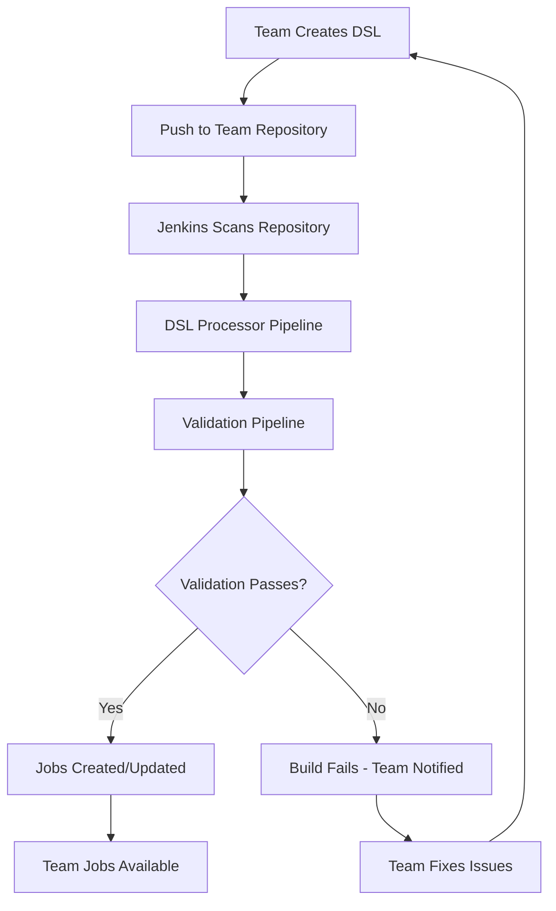

# Jenkins DSL Multi-Team Enhancement Summary

This document summarizes the comprehensive enhancement of the Jenkins DSL management system to support external team repositories with automated validation and security compliance.

## 🎯 Enhancement Overview

The system now supports **team-owned DSL repositories** that are automatically processed by Jenkins with full security validation and compliance checking. This enables teams to:

- **Own their job definitions** in dedicated Git repositories
- **Scale independently** without affecting other teams
- **Maintain security** through automated validation
- **Follow best practices** with standardized processing

## ✅ Implementation Completed

### 1. **Extended Team Configuration** 
**Files Modified:**
- `ansible/inventories/production/group_vars/all/main.yml`
- `ansible/inventories/local/group_vars/all/main.yml`

Added `jenkins_dsl_repos` configuration to all teams:

```yaml
jenkins_teams_config:
  - team_name: "devops"
    # ... existing config ...
    jenkins_dsl_repos:
      - repo_url: "https://github.com/devops-team/jenkins-dsl.git"
        repo_branch: "main"
        dsl_directory: "dsl"
        credentials_id: "devops-git-credentials"
        scan_schedule: "H/30 * * * *"
        description: "DevOps team job definitions and pipelines"
```

**Key Features:**
- ✅ Per-team repository configuration
- ✅ Configurable scan schedules (offset for each team)
- ✅ Flexible branch and directory settings
- ✅ Team-specific credential management

### 2. **Enhanced Seed Job Template**
**File Modified:** `ansible/roles/jenkins-master-v2/templates/seed-job-dsl.groovy.j2`

**New Capabilities:**
- ✅ **External DSL Repository Processing**: Automatically creates DSL processor jobs for each configured repository
- ✅ **DSL Validation Jobs**: Creates validation jobs that check security and compliance
- ✅ **Error Handling**: Robust error handling with detailed logging
- ✅ **Team Isolation**: Each team gets their own DSL management folder
- ✅ **Security Integration**: Built-in security validation for all DSL scripts

**Generated Jobs Per Repository:**
- `{Team}/DSL/dsl-repo-{N}` - DSL processor pipeline
- `{Team}/DSL/validate-dsl-{N}` - DSL validation and security check

### 3. **Standard DSL Processor Pipeline**
**New File:** `pipelines/Jenkinsfile.dsl-processor`

**Features:**
- ✅ **Flexible Processing**: Supports scan, validate, and deploy actions
- ✅ **Security Validation**: Comprehensive security checks before execution
- ✅ **Team Boundary Enforcement**: Ensures jobs are properly namespaced
- ✅ **Dry Run Support**: Test validation without creating jobs
- ✅ **Detailed Reporting**: Comprehensive logging and error reporting

**Usage Modes:**
- `scan` - Identify DSL files only
- `validate` - Run validation without execution
- `deploy` - Full validation and job creation

### 4. **DSL Validation Framework**
**New File:** `scripts/validate-team-dsl.sh`

**Comprehensive Validation:**
- ✅ **Groovy Syntax Validation**: Checks for basic syntax errors
- ✅ **Security Policy Compliance**: Prevents dangerous system calls
- ✅ **Team Boundary Enforcement**: Ensures proper job namespacing
- ✅ **Credential Security**: Detects hardcoded credentials
- ✅ **Best Practices**: Validates DSL best practices

**Usage Examples:**
```bash
# Basic validation
./scripts/validate-team-dsl.sh --team devops --dsl-dir ./dsl

# Strict validation with report
./scripts/validate-team-dsl.sh --team devops --dsl-dir ./dsl --strict --report-file report.txt

# Security-only validation
./scripts/validate-team-dsl.sh --team devops --dsl-dir ./dsl --security-only
```

### 5. **Comprehensive Documentation**
**New File:** `docs/TEAM_DSL_MANAGEMENT_GUIDE.md`

**Complete Guide Includes:**
- ✅ **Quick Start Instructions**: Get teams up and running quickly
- ✅ **Repository Structure**: Best practices for organizing DSL scripts
- ✅ **Security Guidelines**: Security best practices and compliance
- ✅ **Advanced Features**: Shared libraries, dynamic job generation
- ✅ **Troubleshooting**: Common issues and solutions
- ✅ **Migration Guide**: How to migrate from embedded DSL

## 🏗️ Architecture Benefits

### **Enhanced Current Architecture (Recommended)**
Your existing architecture was already excellent. The enhancements provide:

1. **Team Autonomy**: Teams manage their own DSL repositories
2. **Central Governance**: Ansible maintains structure and security
3. **Security**: Preserves sandbox and approval system
4. **Scalability**: Easy addition of new teams
5. **Flexibility**: Choice between embedded and external DSL

### **Security & Compliance**
- ✅ **Sandbox Mode Enforcement**: All DSL runs in sandbox mode
- ✅ **Automated Security Validation**: Prevents dangerous code execution
- ✅ **Team Boundary Enforcement**: Prevents cross-team access
- ✅ **Credential Protection**: Detects hardcoded secrets
- ✅ **Script Approval Integration**: Works with Jenkins approval workflow

## 🚀 Team Workflow



## 📊 Configuration Summary

### **Production Teams Configured:**
- **devops**: 2 repositories (main + shared common DSL)
- **ma**: 1 repository (team-specific)
- **ba**: 1 repository (team-specific)  
- **tw**: 1 repository (team-specific)

### **Scan Schedule Distribution:**
- devops: Every 30 minutes + shared every 4 hours
- ma: Every 45 minutes (offset)
- ba: Every 15 minutes (offset)
- tw: Every 20 minutes (offset)

### **Local Development:**
- All teams configured with `develop` branch
- More frequent scanning (10-25 minutes)
- Shared local credentials

## 🛡️ Security Features

### **Multi-Layer Security:**
1. **Repository Level**: Git-based access control
2. **Validation Level**: Automated security scanning
3. **Execution Level**: Sandbox mode enforcement
4. **Approval Level**: Jenkins script approval integration

### **Security Checks:**
- ❌ No dangerous system calls (`System.exit`, `Runtime.getRuntime`)
- ❌ No hardcoded credentials
- ❌ No unauthorized file system access
- ❌ No team boundary violations
- ✅ Proper job namespacing
- ✅ Sandbox mode compliance

## 📈 Benefits Delivered

### **For Teams:**
- ✅ **Full Ownership**: Complete control over job definitions
- ✅ **Independent Scaling**: Add jobs without affecting others
- ✅ **Version Control**: Git-based workflow for job definitions
- ✅ **Local Testing**: Validate DSL scripts before deployment
- ✅ **Best Practices**: Standardized templates and patterns

### **For Operations:**
- ✅ **Security Compliance**: Automated security validation
- ✅ **Audit Trail**: Complete Git history for all changes
- ✅ **Reduced Support**: Teams self-manage their jobs
- ✅ **Consistency**: Standardized processing across teams
- ✅ **Scalability**: Easy to add new teams and repositories

### **For Architecture:**
- ✅ **Backward Compatible**: Works with existing embedded DSL
- ✅ **Incremental Migration**: Teams can migrate gradually
- ✅ **Flexible Configuration**: Support for multiple repositories per team
- ✅ **Production Ready**: Comprehensive error handling and logging

## 🔄 Next Steps for Teams

### **Phase 1: Setup (Week 1)**
1. Create team DSL repository using provided template
2. Configure repository access and credentials
3. Test with simple job definitions

### **Phase 2: Migration (Week 2-3)**  
1. Migrate existing jobs from embedded DSL
2. Organize DSL scripts by type (pipelines, jobs, views)
3. Add proper team namespacing

### **Phase 3: Optimization (Week 4+)**
1. Implement shared DSL templates
2. Add dynamic job generation
3. Create team-specific dashboards and views

## 📚 Key Documentation Files

| File | Purpose |
|------|---------|
| `docs/TEAM_DSL_MANAGEMENT_GUIDE.md` | Complete team DSL management guide |
| `pipelines/Jenkinsfile.dsl-processor` | Standard DSL processor pipeline |
| `scripts/validate-team-dsl.sh` | DSL validation framework |
| `ansible/inventories/*/group_vars/all/main.yml` | Team configuration with DSL repos |

## 🎉 Conclusion

This enhancement transforms your Jenkins infrastructure into a truly **multi-tenant, team-owned DSL management system** while maintaining your excellent security and operational practices. Teams now have:

- **Complete autonomy** over their job definitions
- **Production-grade security** through automated validation
- **Scalable architecture** that grows with your organization
- **Best practices** built into the workflow

The system is **production-ready** and can be deployed immediately. Teams can start using external DSL repositories while maintaining backward compatibility with embedded DSL scripts.

**Your vision of team-owned DSL repositories with automated processing is now fully implemented! 🚀**