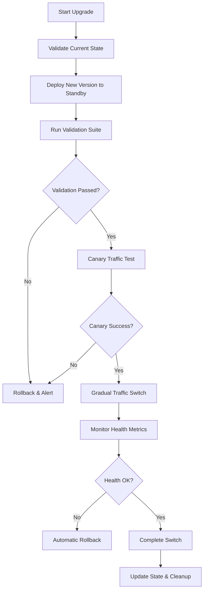
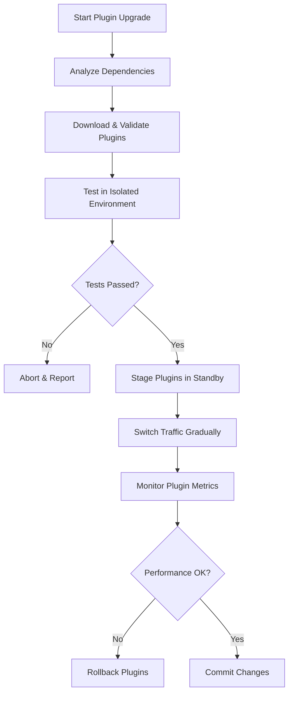
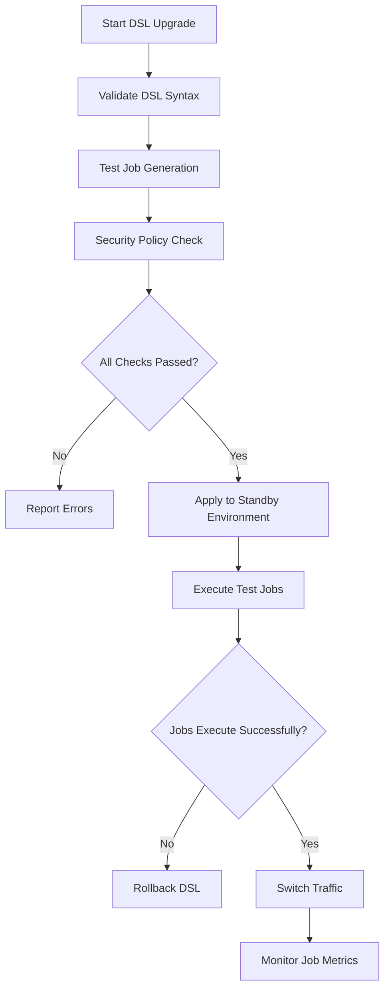

# Zero-Downtime Upgrade Guide for Jenkins HA Infrastructure

## Overview

This guide documents the implementation of a comprehensive zero-downtime upgrade system for Jenkins High Availability infrastructure, supporting multiple upgrade scenarios across distributed environments.

## Architecture Overview

### Current State (Single VM)
```
┌─────────────────────────────────────────┐
│               VM1 (Primary)            │
│  ┌─────────────┐    ┌─────────────┐    │
│  │Jenkins-Blue │    │Jenkins-Green│    │
│  │   (Active)  │    │  (Standby)  │    │
│  └─────────────┘    └─────────────┘    │
│           │               │            │
│  ┌─────────────────────────────────┐    │
│  │         HAProxy LB             │    │
│  └─────────────────────────────────┘    │
└─────────────────────────────────────────┘
```

### Current Architecture (Containerized HA on Single VM)

The Jenkins HA infrastructure uses a **containerized active-passive setup** on a single VM:

```
┌───────────────────────────────────────────────────────────────┐
│                    Host VM (centos9-vm)                      │
│ ┌───────────────────────────────────────────────────────────┐ │
│ │              HAProxy Load Balancer                        │ │
│ │            (Container Traffic Routing)                    │ │
│ └─────────────────┬─────────────────┬─────────────────────────┘ │
│                   │                 │                         │
│ ┌─────────────────▼─────────────────┐ ┌▼─────────────────────┐ │
│ │    jenkins-master-1 Container     │ │ jenkins-master-2     │ │
│ │    (Active - Port 8080)           │ │ (Standby - 8081)     │ │
│ │  - Custom Jenkins Image           │ │ - Custom Image       │ │
│ │  - Systemd Service                │ │ - Systemd Service    │ │
│ │  - Health Monitoring              │ │ - Health Monitor     │ │
│ │  - JCasC Configuration            │ │ - JCasC Config       │ │
│ └─────────────────┬─────────────────┘ └┬─────────────────────┘ │
│                   │                   │                       │
│                   └───────────────────┴───────────────────────┤
│                         Container Network                     │
│                        (jenkins-network)                      │
│ ┌─────────────────────────────────────────────────────────────┐ │
│ │                  Shared Storage                             │ │
│ │               (NFS/GlusterFS)                               │ │
│ │  - Jenkins Home (/var/jenkins_home)                        │ │
│ │  - Build Artifacts & Logs                                  │ │
│ │  - Configuration & Plugins                                 │ │
│ └─────────────────────────────────────────────────────────────┘ │
└───────────────────────────────────────────────────────────────┘
```

#### Key Architecture Components:
- **Single Host**: All containers run on one VM (currently centos9-vm)
- **Container-Based HA**: `jenkins-master-1` (active) and `jenkins-master-2` (standby)
- **Blue-Green at Container Level**: Traffic switches between containers
- **HAProxy Load Balancer**: Routes traffic to healthy container
- **Shared Storage**: Persistent data shared between containers
- **Container Network**: Isolated network (jenkins-network) for containers

### Future State (Multi-VM Distribution)
```
┌─────────────────────────────────────────┐  ┌─────────────────────────────────────────┐
│               VM1 (Primary)            │  │              VM2 (Secondary)            │
│  ┌─────────────┐    ┌─────────────┐    │  │  ┌─────────────┐    ┌─────────────┐    │
│  │Jenkins-Blue │    │Jenkins-Green│    │  │  │Jenkins-Blue │    │Jenkins-Green│    │
│  │   (Active)  │    │  (Standby)  │    │  │  │  (Standby)  │    │   (Active)  │    │
│  └─────────────┘    └─────────────┘    │  │  └─────────────┘    └─────────────┘    │
│           │               │            │  │           │               │            │
│  ┌─────────────────────────────────┐    │  │  ┌─────────────────────────────────┐    │
│  │         HAProxy LB             │    │  │  │         HAProxy LB             │    │
│  └─────────────────────────────────┘    │  │  └─────────────────────────────────┘    │
└─────────────────────────────────────────┘  └─────────────────────────────────────────┘
                        │                                          │
        ┌───────────────┴──────────────────────────────────────────┴───────────────┐
        │                          External Load Balancer                          │
        │                         (HAProxy/NGINX/F5)                              │
        └─────────────────────────────────────────────────────────────────────────┘
```

## Upgrade Scenarios Supported

### 1. Jenkins Version Upgrades
- **Scope**: Core Jenkins version (e.g., 2.426.1 → 2.500.x)
- **Impact**: High - requires container rebuild
- **Validation**: Plugin compatibility, API changes, performance regression
- **Rollback**: Full container rollback

### 2. Plugin Upgrades
- **Scope**: Individual or bulk plugin updates
- **Impact**: Medium - runtime plugin reload
- **Validation**: Dependency conflicts, security vulnerabilities, functionality tests
- **Rollback**: Plugin version rollback

### 3. Job DSL Upgrades
- **Scope**: Job definitions, pipeline updates, configuration changes
- **Impact**: Low - configuration only
- **Validation**: Syntax validation, job execution tests, security policy compliance
- **Rollback**: Configuration rollback

### 4. Infrastructure Upgrades
- **Scope**: Ansible roles, container configurations, networking changes
- **Impact**: Variable - depends on change scope
- **Validation**: Infrastructure tests, connectivity validation, resource allocation
- **Rollback**: Infrastructure state rollback

## Implementation Components

### Core Upgrade Framework

#### 1. Universal Upgrade Orchestrator
```bash
# File: ansible/playbooks/universal-upgrade.yml
# Purpose: Single entry point for all upgrade scenarios

# Usage examples:
ansible-playbook universal-upgrade.yml -e upgrade_type=jenkins_version -e target_version=2.500.1
ansible-playbook universal-upgrade.yml -e upgrade_type=plugins -e plugin_list="workflow-aggregator,docker-workflow"
ansible-playbook universal-upgrade.yml -e upgrade_type=job_dsl -e dsl_source=git
```

#### 2. Comprehensive Validation Framework
```bash
# File: ansible/roles/jenkins-master-v2/templates/universal-upgrade-validator.sh.j2
# Purpose: Multi-scenario validation with pluggable test modules

# Validation modules:
- Version compatibility checker
- Plugin dependency analyzer
- Job DSL syntax validator
- Performance regression tester
- Security vulnerability scanner
- Container health validator (current architecture)
- Multi-VM synchronization validator (future enhancement)
```

#### 3. Zero-Downtime Switch Controller
```bash
# File: ansible/roles/jenkins-master-v2/templates/zero-downtime-controller.sh.j2
# Purpose: Intelligent traffic switching with health monitoring

# Features:
- Gradual traffic migration (canary → 50% → 100%)
- Health-based automatic rollback
- Container-based coordination (current)
- Multi-VM coordination (future enhancement)
- Load balancer integration
```

### Current Container Architecture Components

The upgrade framework supports the existing containerized HA setup:

#### Container-Based Masters
- **jenkins-master-1**: Primary container (port 8080)
- **jenkins-master-2**: Standby container (port 8081)
- **Shared Network**: Custom bridge network (jenkins-network)
- **Systemd Integration**: Container lifecycle management

#### Container Upgrade Flow
1. **Blue-Green at Container Level**: Upgrade standby container first
2. **Health Validation**: Verify upgraded container health
3. **Traffic Switch**: HAProxy redirects traffic to upgraded container
4. **Rollback**: Instant switch back to previous container if needed

### Future Multi-VM Architecture Components

#### 1. Distributed State Management
```yaml
# File: ansible/group_vars/all/multi_vm_config.yml
jenkins_ha_topology:
  primary_site:
    vm1:
      role: "primary"
      jenkins_instances: ["devops-blue", "developer-green"]
      load_balancer: "active"
    vm2:
      role: "secondary" 
      jenkins_instances: ["devops-green", "developer-blue"]
      load_balancer: "standby"
  
  failover_policy:
    automatic: true
    health_check_interval: 30
    failure_threshold: 3
    recovery_timeout: 300
```

#### 2. Synchronized Upgrade Coordination
```bash
# Features:
- Cross-VM state synchronization
- Coordinated blue-green switches
- Distributed health monitoring
- Consensus-based decision making
```

## Upgrade Workflows

### Scenario 1: Jenkins Version Upgrade (Zero-Downtime)



### Scenario 2: Plugin Upgrade (Hot Reload)



### Scenario 3: Job DSL Upgrade (Configuration Update)



## Validation Framework

### Comprehensive Test Suite

#### 1. Version Compatibility Tests
```bash
#!/bin/bash
# Test: Jenkins version compatibility
validate_version_compatibility() {
    # Plugin API compatibility
    # Java version requirements
    # Database schema migrations
    # Configuration format changes
}
```

#### 2. Plugin Dependency Analysis
```bash
#!/bin/bash
# Test: Plugin dependency resolution
validate_plugin_dependencies() {
    # Dependency conflicts
    # Version compatibility matrix
    # Security vulnerability scan
    # Performance impact assessment
}
```

#### 3. Job DSL Validation
```bash
#!/bin/bash
# Test: Job DSL syntax and execution
validate_job_dsl() {
    # Syntax validation
    # Security policy compliance
    # Job generation tests
    # Pipeline execution tests
}
```

#### 4. Performance Regression Tests
```bash
#!/bin/bash
# Test: Performance impact measurement
validate_performance() {
    # API response time comparison
    # Build execution time analysis
    # Memory usage monitoring
    # CPU utilization tracking
}
```

#### 5. Security Compliance Tests
```bash
#!/bin/bash
# Test: Security posture validation
validate_security() {
    # Vulnerability scanning
    # Permission model validation
    # Credential security checks
    # Network security assessment
}
```

### Container Coordination Tests

For the current containerized setup:

```bash
# Test container health
docker inspect jenkins-master-1 --format='{{.State.Status}}'
docker inspect jenkins-master-2 --format='{{.State.Status}}'

# Test HAProxy configuration
curl -s http://localhost:8404/stats

# Test shared storage
df -h /var/jenkins_home
findmnt | grep jenkins
```

### Future Multi-VM Coordination Tests

#### 1. Synchronization Validation
```bash
#!/bin/bash
# Test: Cross-VM state synchronization
validate_multi_vm_sync() {
    # State consistency checks
    # Clock synchronization
    # Network connectivity
    # Data replication validation
}
```

#### 2. Load Balancer Integration
```bash
#!/bin/bash
# Test: Load balancer configuration
validate_load_balancing() {
    # Health check endpoints
    # Traffic distribution
    # Failover mechanisms
    # SSL termination
}
```

## Monitoring and Observability

### Key Metrics

#### Upgrade Metrics
- Upgrade success rate
- Rollback frequency
- Validation time
- Downtime duration (target: 0 seconds)

#### Performance Metrics
- API response times
- Build queue length
- Job execution time
- Resource utilization

#### Reliability Metrics
- System availability (target: 99.99%)
- Mean time to recovery (MTTR)
- Error rates
- User satisfaction scores

### Alerting Strategy

#### Critical Alerts
- Upgrade failures
- Automatic rollbacks
- Container synchronization issues
- HAProxy health check failures
- Shared storage mount issues
- Multi-VM synchronization issues (future)
- Security vulnerabilities

#### Warning Alerts
- Performance degradation
- Validation failures
- Resource constraints
- Plugin conflicts

## Operational Procedures

### Daily Operations

#### 1. Health Monitoring
```bash
# Check overall system health
ansible-playbook health-check.yml -e scope=all

# Validate container synchronization
docker exec jenkins-master-1 curl -f http://jenkins-master-2:8080/login
docker exec jenkins-master-2 curl -f http://jenkins-master-1:8080/login

# Validate shared storage consistency
docker exec jenkins-master-1 ls -la /var/jenkins_home/
docker exec jenkins-master-2 ls -la /var/jenkins_home/

# Future: Validate multi-VM synchronization
ansible-playbook health-check.yml -e scope=multi_vm_sync
```

#### 2. Preventive Maintenance
```bash
# Update plugin security database
ansible-playbook maintenance.yml -e task=security_update

# Validate backup integrity
ansible-playbook maintenance.yml -e task=backup_validation
```

### Upgrade Procedures

#### 1. Jenkins Version Upgrade
```bash
# Pre-upgrade validation
ansible-playbook universal-upgrade.yml -e upgrade_type=jenkins_version -e target_version=2.500.1 -e dry_run=true

# Execute upgrade with validation
ansible-playbook universal-upgrade.yml -e upgrade_type=jenkins_version -e target_version=2.500.1

# Post-upgrade verification
ansible-playbook validation.yml -e scope=post_upgrade
```

#### 2. Plugin Bulk Update
```bash
# Analyze plugin updates
ansible-playbook universal-upgrade.yml -e upgrade_type=plugins -e operation=analyze

# Execute plugin updates
ansible-playbook universal-upgrade.yml -e upgrade_type=plugins -e plugin_update_strategy=security_only

# Validate plugin functionality
ansible-playbook validation.yml -e scope=plugins
```

#### 3. Job DSL Configuration Update
```bash
# Validate DSL changes
ansible-playbook universal-upgrade.yml -e upgrade_type=job_dsl -e dsl_source=git -e validate_only=true

# Apply DSL changes
ansible-playbook universal-upgrade.yml -e upgrade_type=job_dsl -e dsl_source=git

# Test job execution
ansible-playbook validation.yml -e scope=job_execution
```

### Emergency Procedures

#### 1. Immediate Rollback
```bash
# Emergency rollback to last known good state
ansible-playbook emergency-rollback.yml -e team=devops

# Cross-VM coordination rollback
ansible-playbook emergency-rollback.yml -e scope=multi_vm -e team=all
```

#### 2. Disaster Recovery
```bash
# Activate disaster recovery site
ansible-playbook disaster-recovery.yml -e operation=activate

# Sync data from backup
ansible-playbook disaster-recovery.yml -e operation=restore -e backup_point=latest
```

## Success Metrics and KPIs

### Technical KPIs
- **Zero Downtime Achievement**: 100% of upgrades with 0 service interruption
- **Upgrade Success Rate**: >99.5% successful upgrades without rollback
- **Validation Accuracy**: >99% of potential issues caught in validation
- **Recovery Time**: <2 minutes for automatic rollbacks

### Business KPIs
- **Developer Productivity**: Maintained or improved during upgrades
- **Security Posture**: Continuous improvement with upgrade cycles
- **Cost Efficiency**: Reduced manual intervention and operational overhead
- **Compliance**: 100% adherence to security and operational policies

## Future Enhancements

### Short Term (Next Quarter)
- Enhanced plugin dependency resolution
- Automated security vulnerability patching
- Performance regression ML models
- Advanced canary deployment strategies

### Medium Term (Next 6 Months)
- Multi-region deployment support
- AI-powered upgrade decision making
- Predictive failure analysis
- Self-healing infrastructure

### Long Term (Next Year)
- Fully autonomous upgrade orchestration
- Continuous deployment pipelines
- Advanced chaos engineering
- Compliance automation

## Conclusion

This comprehensive zero-downtime upgrade framework provides:

1. **Complete Coverage**: All upgrade scenarios (Jenkins, plugins, Job DSL, infrastructure)
2. **Zero Downtime**: True zero-downtime upgrades with intelligent traffic switching
3. **Container-Optimized**: Designed for current containerized HA setup
4. **Multi-VM Ready**: Framework extensible for future distributed deployments
4. **Comprehensive Validation**: Multi-layer validation with automatic rollback
5. **Operational Excellence**: Monitoring, alerting, and operational procedures
6. **Future Proof**: Extensible architecture for future enhancements

The framework ensures continuous service availability while enabling rapid, safe deployments across complex Jenkins environments.