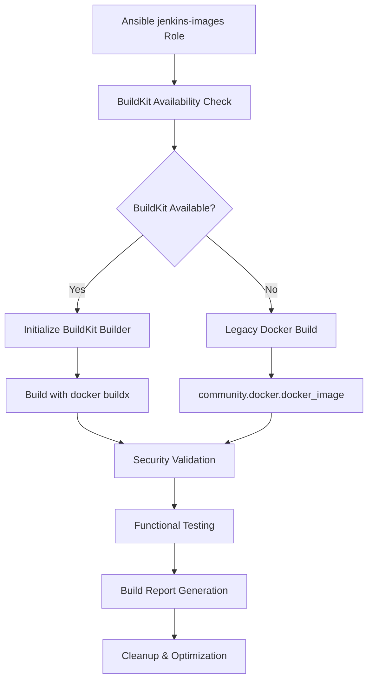

# Production-Ready BuildKit Docker Integration for Jenkins HA

This document provides comprehensive guidance on the advanced BuildKit Docker image building solution implemented for the Jenkins HA infrastructure.

## 🚀 Overview

The Jenkins HA project now includes a production-ready Docker image building system that leverages Docker BuildKit for enhanced performance, security, and reliability. This implementation addresses the critical limitation of the Ansible `community.docker.docker_image` module which doesn't support BuildKit features like `--mount` options.

### Key Features

- **🏗️ Advanced BuildKit Integration**: Native `docker buildx build` commands with full BuildKit support
- **🔄 Intelligent Fallback System**: Automatic fallback to legacy Docker builds when BuildKit is unavailable
- **🛡️ Comprehensive Security Scanning**: Integrated Trivy vulnerability scanning with configurable thresholds
- **📊 Advanced Build Validation**: Multi-layer validation including functional testing
- **⚡ Performance Optimization**: Build caching, parallel processing, and resource management
- **🔧 Production Reliability**: Retry mechanisms, error handling, and automated recovery
- **📋 Comprehensive Reporting**: Detailed build reports and metrics collection

## 🏗️ Architecture

### Core Components



### Build Flow

1. **Pre-build Validation**: Check Docker daemon, BuildKit availability, and system resources
2. **Builder Initialization**: Create or reuse optimized BuildKit builder instance
3. **Image Building**: Execute builds with comprehensive error handling and retry logic
4. **Security Scanning**: Automated vulnerability scanning with Trivy
5. **Functional Validation**: Container startup and endpoint testing
6. **Cleanup & Optimization**: Resource cleanup and cache management

## 🔧 Implementation Details

### BuildKit Builder Management

The system creates a dedicated BuildKit builder with optimal configuration:

```yaml
# Builder configuration
jenkins_build_builder_name: "jenkins-builder"
jenkins_build_buildx_driver: "docker-container"
jenkins_build_platform: "linux/amd64"
jenkins_build_memory_limit: "4g"
jenkins_build_cpu_limit: "2"
```

### Advanced Build Options

Full support for BuildKit features including:

- **Multi-stage builds** with `--target` specification
- **Build caching** with inline and registry cache
- **Resource limits** for memory and CPU usage
- **Platform specification** for multi-architecture builds
- **Progress reporting** with configurable output formats

### Error Handling & Retry Logic

Robust error handling with exponential backoff:

```bash
# Retry mechanism with exponential backoff
retry_count=0
max_retries=3
retry_delay=30

while [ $retry_count -lt $max_retries ]; do
  if docker buildx build ...; then
    echo "Build successful"
    exit 0
  else
    retry_count=$((retry_count + 1))
    retry_delay=$((retry_delay * 2))  # Exponential backoff
    sleep $retry_delay
  fi
done
```

## 🛠️ Configuration

### Essential Variables

```yaml
# BuildKit Configuration
jenkins_build_use_buildkit: true
jenkins_build_builder_name: "jenkins-builder"
jenkins_build_fallback_enabled: true

# Build Performance
jenkins_build_retry_count: 3
jenkins_build_retry_delay: 30
jenkins_build_timeout: 1800  # 30 minutes
jenkins_build_parallel_downloads: 4

# Security & Validation
jenkins_build_scan_vulnerabilities: true
jenkins_build_fail_on_critical: true
jenkins_build_validate_images: true
jenkins_build_functional_tests: true

# Resource Management
jenkins_build_memory_limit: "4g"
jenkins_build_cpu_limit: "2"
jenkins_build_cache_inline: "1"
```

### Advanced Configuration Options

```yaml
# Multi-Architecture Support
jenkins_build_multiarch_enabled: false
jenkins_build_target_platforms:
  - "linux/amd64"
  - "linux/arm64"

# Advanced Caching
jenkins_build_cache_registry: "registry.example.com"
jenkins_build_cache_mode: "max"
jenkins_build_cache_compression: "gzip"

# Security Enhancement
jenkins_build_security_scanner: "trivy"
jenkins_build_fail_on_high: false
jenkins_build_sbom_generation: true
jenkins_build_provenance: true

# Build Optimization
jenkins_build_layer_caching: true
jenkins_build_squash_layers: false
jenkins_build_compress_context: true
```

## 🚀 Usage Examples

### Basic Usage

```bash
# Build all Jenkins images with BuildKit
ansible-playbook -i inventories/production/hosts.yml site.yml --tags jenkins-images

# Build specific image type
ansible-playbook -i inventories/production/hosts.yml site.yml --tags jenkins-images -e images_to_build=master

# Force rebuild with BuildKit
ansible-playbook -i inventories/production/hosts.yml site.yml --tags jenkins-images -e jenkins_images_force_rebuild=true
```

### Advanced Usage

```bash
# Build with enhanced security scanning
ansible-playbook -i inventories/production/hosts.yml site.yml --tags jenkins-images \
  -e jenkins_build_scan_vulnerabilities=true \
  -e jenkins_build_fail_on_critical=true

# Build with custom builder configuration
ansible-playbook -i inventories/production/hosts.yml site.yml --tags jenkins-images \
  -e jenkins_build_builder_name=custom-builder \
  -e jenkins_build_memory_limit=8g

# Build for multiple architectures
ansible-playbook -i inventories/production/hosts.yml site.yml --tags jenkins-images \
  -e jenkins_build_multiarch_enabled=true \
  -e jenkins_build_target_platforms='["linux/amd64","linux/arm64"]'
```

### Testing and Validation

```bash
# Comprehensive testing
ansible-playbook -i inventories/local/hosts.yml test-buildkit-images.yml

# Test specific image with validation
ansible-playbook -i inventories/local/hosts.yml test-buildkit-images.yml \
  -e images_to_build=master \
  -e jenkins_build_validate_images=true

# Test without BuildKit (fallback mode)
ansible-playbook -i inventories/local/hosts.yml test-buildkit-images.yml \
  -e jenkins_build_use_buildkit=false
```

## 🔧 Troubleshooting

### Common Issues and Solutions

#### 1. BuildKit Not Available

**Symptoms:**
```
buildkit_available: buildkit_unavailable
Build method: legacy
```

**Solutions:**
```bash
# Install BuildKit
sudo apt-get update && sudo apt-get install docker-buildx-plugin

# Enable BuildKit in daemon
echo '{"features": {"buildkit": true}}' | sudo tee /etc/docker/daemon.json
sudo systemctl restart docker

# Run troubleshooting playbook
ansible-playbook troubleshoot-buildkit.yml -e troubleshoot_mode=fix
```

#### 2. Build Cache Issues

**Symptoms:**
```
Error: failed to solve: failed to compute cache key
Cache size exceeds limit
```

**Solutions:**
```bash
# Clean build cache
docker buildx prune --all --force

# Run optimization
ansible-playbook troubleshoot-buildkit.yml -e troubleshoot_mode=optimize

# Reset BuildKit environment
ansible-playbook troubleshoot-buildkit.yml -e troubleshoot_mode=reset
```

#### 3. Image Build Failures

**Symptoms:**
```
Build failed with exit code: 1
Plugin installation failed
```

**Solutions:**
```bash
# Check system resources
df -h /var/lib/docker
free -h

# Increase build timeout
ansible-playbook site.yml --tags jenkins-images -e jenkins_build_timeout=3600

# Enable debug logging
ansible-playbook site.yml --tags jenkins-images -e jenkins_build_progress=plain -vvv
```

### Comprehensive Diagnostics

```bash
# Full diagnostic scan
ansible-playbook troubleshoot-buildkit.yml

# Automatic issue resolution
ansible-playbook troubleshoot-buildkit.yml -e troubleshoot_mode=fix

# Performance optimization
ansible-playbook troubleshoot-buildkit.yml -e troubleshoot_mode=optimize
```

## 📊 Monitoring and Metrics

### Build Report Structure

```yaml
jenkins_build_report:
  build_timestamp: "2024-01-15T10:30:00Z"
  build_configuration:
    images_to_build: "all"
    buildkit_enabled: true
    validation_enabled: true
    security_scan_enabled: true
  build_results:
    jenkins_master:
      built: true
      method: "buildkit"
      image_id: "sha256:abc123..."
      validated: true
    jenkins_agents:
      dind:
        built: true
        method: "buildkit"
        validated: true
```

### Key Metrics to Monitor

- **Build Success Rate**: Percentage of successful builds
- **Build Duration**: Time taken for complete build process
- **Cache Hit Rate**: Effectiveness of build caching
- **Security Scan Results**: Number of vulnerabilities detected
- **Resource Usage**: CPU, memory, and disk utilization during builds

## 🔒 Security Considerations

### Vulnerability Scanning

The system includes comprehensive security scanning:

```yaml
# Security configuration
jenkins_build_scan_vulnerabilities: true
jenkins_build_security_scanner: "trivy"
jenkins_build_fail_on_critical: true
jenkins_build_fail_on_high: false
jenkins_build_security_timeout: 300
```

### Build Security Features

- **Non-privileged builds**: All builds run without root privileges where possible
- **Resource limits**: CPU and memory limits prevent resource exhaustion
- **Network isolation**: Builds can run in isolated networks
- **Image signing**: Support for image signing and verification (optional)
- **SBOM generation**: Software Bill of Materials for supply chain security

## 🚀 Performance Optimization

### Build Caching Strategy

1. **Inline Cache**: Built into image layers
2. **Registry Cache**: Shared across build environments
3. **Mount Cache**: Persistent cache for package managers

### Resource Optimization

```yaml
# Optimized resource settings
jenkins_build_memory_limit: "4g"
jenkins_build_cpu_limit: "2"
jenkins_build_parallel_downloads: 4
jenkins_build_compress_context: true
```

### Cache Management

Automatic cache cleanup based on:
- **Size limits**: Maximum cache size (default: 10GB)
- **Age**: Remove cache older than 72 hours
- **Usage**: Intelligent cleanup based on usage patterns

## 🎯 Best Practices

### 1. Build Configuration

- Use specific version tags for reproducible builds
- Enable comprehensive validation in production
- Configure appropriate resource limits
- Implement regular cache cleanup

### 2. Security

- Always enable vulnerability scanning
- Set appropriate failure thresholds
- Regularly update base images
- Monitor security scan results

### 3. Performance

- Use multi-stage Dockerfiles for optimal layer caching
- Implement build parallelization where possible
- Monitor build metrics and optimize accordingly
- Use registry cache for distributed builds

### 4. Monitoring

- Set up alerts for build failures
- Monitor resource usage trends
- Track security scan results
- Implement automated reporting

## 🔮 Future Enhancements

### Planned Features

1. **Multi-Architecture Builds**: Full support for ARM64 and other architectures
2. **Distributed Builds**: BuildKit cluster support for scalability
3. **Advanced Caching**: Registry-based cache sharing across environments
4. **Integration with CI/CD**: Enhanced pipeline integration
5. **Metrics Dashboard**: Real-time build metrics visualization

### Roadmap

- **Q1 2024**: Multi-architecture support
- **Q2 2024**: Distributed build clusters
- **Q3 2024**: Advanced monitoring dashboard
- **Q4 2024**: Supply chain security enhancements

## 📚 Additional Resources

### Documentation

- [Docker BuildKit Documentation](https://docs.docker.com/build/buildkit/)
- [BuildX Reference](https://docs.docker.com/buildx/)
- [Trivy Security Scanner](https://trivy.dev/)

### Scripts and Tools

- `test-buildkit-images.yml`: Comprehensive testing playbook
- `troubleshoot-buildkit.yml`: Diagnostic and repair toolkit
- `/usr/local/bin/jenkins-buildkit-cache-manager.sh`: Cache management utility

### Support

For issues and questions:
1. Review troubleshooting section
2. Run diagnostic playbook
3. Check build logs and reports
4. Consult team documentation

---

*This implementation represents a significant advancement in the Jenkins HA infrastructure, providing enterprise-grade Docker image building capabilities with comprehensive security, validation, and monitoring features.*