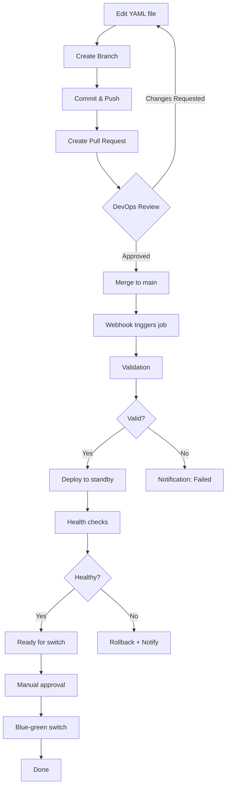

# Jenkins Team Configuration Files

This directory contains Jenkins Configuration-as-Code (JCasC) files for each team. These files control the runtime configuration of Jenkins instances.

## 🆕 New Symlink-Based Update Approach

**Important**: This repository now uses a **simplified symlink-based approach** for configuration updates:
- ✅ **Zero-downtime updates** via hot-reload (no container restart)
- ✅ **Single container per team** (eliminates blue-green container complexity)
- ✅ **Faster switches** (<1 second symlink + 1-5 second reload)
- ✅ **Simpler workflow** (validate → switch symlink → hot-reload)
- ✅ **Automatic rollback** on failure

**For detailed documentation**, see: [`docs/SYMLINK-CONFIG-UPDATE.md`](../docs/SYMLINK-CONFIG-UPDATE.md)

**To enable symlink mode**, set in your inventory:
```yaml
jenkins_config_update_mode: "symlink"  # Default: "blue-green"
```

## 📋 Table of Contents

- [Quick Start](#quick-start)
- [Files](#files)
- [How It Works](#how-it-works)
- [Making Changes](#making-changes)
- [What You Can Change](#what-you-can-change)
- [What NOT to Change](#what-not-to-change)
- [Workflow](#workflow)
- [Validation](#validation)
- [Rollback](#rollback)
- [Troubleshooting](#troubleshooting)

## 🚀 Quick Start

### For Developer Teams (Making Changes)

```bash
# 1. Create a branch
git checkout -b update-developer-config

# 2. Edit your team's config file
vi jenkins-configs/developer.yml

# 3. Commit and push
git add jenkins-configs/developer.yml
git commit -m "Update developer team agent memory limits"
git push origin update-developer-config

# 4. Create Pull Request
# Go to GitHub/GitLab and create PR

# 5. Wait for DevOps team approval

# 6. After merge:
#    - Config auto-deploys to STANDBY environment
#    - Validate in standby Jenkins UI
#    - Contact DevOps team to switch traffic when ready
```

### For DevOps Team (Approving Changes)

```bash
# 1. Review PR for config changes
# Check: syntax, security implications, resource limits

# 2. Approve and merge PR

# 3. Webhook triggers Jenkins job: "Deploy Team Configuration"
#    - Validates YAML syntax
#    - Runs dry-run test in temp container
#    - Deploys to standby environment
#    - Runs health checks

# 4. Verify standby is healthy
# Access standby Jenkins UI (green port if blue is active)

# 5. Manual blue-green switch
/var/jenkins/scripts/blue-green-switch-<team>.sh

# Or via Jenkins job: "Blue-Green Switch"
```

## 📁 Files

```
jenkins-configs/
├── README.md          # This file
├── devops.yml         # DevOps team configuration
├── developer.yml      # Developer team configuration
└── .gitignore         # Ignore temp/generated files
```

## 🔧 How It Works

### Current State (Before This Feature)

```
Inventory → Ansible Template → jenkins.yaml → Mount to Container
(Git)        (jenkins-config.yml.j2)           (Restart required)

Changes require:
- Edit Ansible inventory
- Run ansible-playbook
- Rebuild containers
```

### New State (Dynamic Config Updates)

```
jenkins-configs/*.yml → Validation → Deploy to Standby → Switch
(Git PR)                  (Auto)        (Auto)            (Manual)

Changes require:
- Edit YAML file in Git
- Create PR (DevOps approves)
- Automatic deployment
- Manual traffic switch
```

### Architecture

```
┌──────────────────────────────────────────┐
│  Git Repository (Source of Truth)        │
│  jenkins-configs/                        │
│    ├── devops.yml                        │
│    └── developer.yml                     │
└───────────────┬──────────────────────────┘
                │
                │ (PR merged)
                ↓
┌───────────────────────────────────────────┐
│  Webhook Trigger                          │
│  → Jenkins Job: "Deploy Team Config"     │
└───────────────┬───────────────────────────┘
                │
                ↓
        ┌───────────────┐
        │  Validation   │
        │  - Syntax     │
        │  - Schema     │
        │  - Dry-run    │
        └───────┬───────┘
                │
                ↓
┌───────────────────────────────────────────┐
│  Determine Standby Environment           │
│  Read: blue-green-state.json              │
│  Active: blue → Deploy to: green          │
└───────────────┬───────────────────────────┘
                │
                ↓
┌───────────────────────────────────────────┐
│  Deploy to Standby                        │
│  1. Copy: devops.yml →                   │
│     /var/jenkins/devops/green/casc_configs/jenkins.yaml
│  2. Restart: jenkins-devops-green         │
│  3. Wait for startup (5 min)             │
└───────────────┬───────────────────────────┘
                │
                ↓
┌───────────────────────────────────────────┐
│  Health Validation                        │
│  - API accessible                         │
│  - Plugins loaded                         │
│  - Agents can connect                     │
│  - Jobs present                           │
└───────────────┬───────────────────────────┘
                │
                ↓ (Manual approval)
┌───────────────────────────────────────────┐
│  Blue-Green Switch                        │
│  - Update HAProxy routing                 │
│  - Switch active environment              │
│  - Zero downtime                          │
└───────────────────────────────────────────┘
```

## ✏️ Making Changes

### What You Can Change

✅ **Agent Configuration** (Safe)
- Instance caps (`instanceCapStr`)
- Memory limits (`memoryLimit`)
- CPU limits (`cpuPeriod`, `cpuQuota`)
- Idle retention time (`idleMinutes`)
- Agent labels (`labelString`)
- Environment variables in agents

Example:
```yaml
instanceCapStr: "20"  # Increase from 10 to 20
memoryLimit: 4294967296  # Increase to 4GB
```

✅ **System Message** (Safe)
```yaml
systemMessage: |
  Custom message for your team
  Contact: devteam@company.com
```

✅ **Job DSL Scripts** (Moderate Risk)
```yaml
jobs:
  - script: |
      folder('MyTeam/NewFolder') {
        displayName('New Project')
      }
```

✅ **Environment Variables** (Safe)
```yaml
globalNodeProperties:
  - envVars:
      env:
        - key: "CUSTOM_VAR"
          value: "custom_value"
```

✅ **Credentials** (Safe - if using env vars)
```yaml
credentials:
  system:
    domainCredentials:
      - credentials:
          - usernamePassword:
              id: "my-new-credential"
              username: "myuser"
              password: "${MY_PASSWORD_ENV_VAR}"
```

### What NOT to Change

❌ **Security Settings** (Requires DevOps Approval)
```yaml
securityRealm:        # DO NOT CHANGE
authorizationStrategy: # DO NOT CHANGE
```

❌ **Core Jenkins Settings**
```yaml
numExecutors: 0  # DO NOT CHANGE - always use dynamic agents
mode: EXCLUSIVE  # DO NOT CHANGE
```

❌ **Docker Socket Path** (Infrastructure Setting)
```yaml
dockerHost:
  uri: "unix:///var/run/docker.sock"  # DO NOT CHANGE
```

❌ **Network Names** (Infrastructure Setting)
```yaml
network: "jenkins-network"  # DO NOT CHANGE
```

## 📝 Workflow

### Normal Update Flow



### Deployment Sequence

1. **Trigger**: PR merged to main branch
2. **Validation** (2-5 minutes):
   - YAML syntax check
   - JCasC schema validation
   - Dry-run test in temporary container
3. **Deployment** (5-10 minutes):
   - Identify standby environment
   - Copy config file to standby
   - Restart standby Jenkins container
   - Wait for Jenkins startup
4. **Health Validation** (5 minutes):
   - API accessibility
   - Plugin loading
   - Agent connectivity
   - Job presence
5. **Ready for Switch**:
   - DevOps team validates manually
   - Traffic switch when ready
   - Zero downtime

## ✅ Validation

### Automatic Validations

#### 1. YAML Syntax Check
```bash
yamllint jenkins-configs/devops.yml
```

#### 2. JCasC Schema Validation
```bash
# Uses Jenkins CLI to validate against JCasC schema
java -jar jenkins-cli.jar -s http://localhost:8080/ \
  reload-jcasc-configuration --validate-only
```

#### 3. Dry-Run Test
```bash
# Starts temporary Jenkins container with new config
docker run --name jenkins-test-${BUILD_NUMBER} \
  -v $(pwd)/devops.yml:/var/jenkins_home/casc_configs/jenkins.yaml \
  jenkins/jenkins-master:latest

# Checks if Jenkins starts successfully
curl -f http://jenkins-test:8080/api/json

# Cleans up
docker rm -f jenkins-test-${BUILD_NUMBER}
```

#### 4. Health Checks on Standby
```bash
/var/jenkins/scripts/blue-green-healthcheck-devops.sh green
```

### Manual Validation

Before switching traffic:
1. Access standby Jenkins UI (green port if blue active)
2. Verify configuration applied correctly
3. Test agent provisioning
4. Run a test build
5. Check logs for errors

## 🔄 Rollback

### Automatic Rollback

If validation or health checks fail:
- Standby config reverted to previous version
- Standby container restarted with old config
- Active environment unaffected (zero impact)
- Notification sent to team

### Manual Rollback

If issues discovered after switch:

```bash
# Quick rollback - switch back to previous environment
/var/jenkins/scripts/blue-green-switch-devops.sh rollback

# Or explicitly switch back
/var/jenkins/scripts/blue-green-switch-devops.sh  # Switches to other env
```

### Git Rollback

```bash
# Revert the commit
git revert <commit-hash>
git push origin main

# This triggers re-deployment with old config
```

## 🐛 Troubleshooting

### Config Validation Failed

**Error**: `YAML syntax error`
```bash
# Check syntax locally
yamllint jenkins-configs/devops.yml

# Common issues:
# - Incorrect indentation (use spaces, not tabs)
# - Missing quotes around special characters
# - Unclosed strings
```

**Error**: `JCasC schema validation failed`
```bash
# Check against JCasC documentation
# https://github.com/jenkinsci/configuration-as-code-plugin

# Common issues:
# - Invalid plugin configuration
# - Missing required fields
# - Incorrect data types
```

### Standby Won't Start

**Symptom**: Jenkins container starts but UI not accessible

```bash
# Check container logs
docker logs jenkins-devops-green

# Common issues:
# - Port conflict
# - Invalid JCasC config (Jenkins fails to start)
# - Missing environment variables
# - Plugin compatibility issues
```

**Solution**:
```bash
# Access container and check config
docker exec jenkins-devops-green cat /var/jenkins_home/casc_configs/jenkins.yaml

# Check Jenkins logs inside container
docker exec jenkins-devops-green cat /var/jenkins_home/logs/jenkins.log
```

### Health Checks Failing

**Symptom**: Validation passes but health checks fail

```bash
# Manual health check
curl -f http://localhost:8090/api/json  # Green port

# Check agent connectivity
curl -f http://localhost:8090/computer/api/json

# Common issues:
# - Jenkins starting but plugins not loaded
# - Agent templates configured incorrectly
# - Network connectivity issues
```

### Config Not Applied After Switch

**Symptom**: Traffic switched but old config still active

```bash
# Verify config file location
ls -la /var/jenkins/devops/blue/casc_configs/

# Check if container mounted correct config
docker inspect jenkins-devops-blue | grep casc_configs

# Force config reload (if Jenkins already running)
curl -X POST http://localhost:8080/reload-jcasc-configuration
```

## 📞 Support

### For Developer Teams

- **Config Questions**: Contact DevOps team
- **Approval Status**: Check PR comments
- **Deployment Status**: Check Jenkins job logs
- **Switch Timing**: Coordinate with DevOps team

### For DevOps Team

- **Validation Failures**: Check job console output
- **Health Check Issues**: Run manual healthcheck script
- **Rollback Needed**: Use blue-green-switch script
- **Emergency**: Restart active container (downtime)

## 📚 Additional Resources

- [Jenkins Configuration as Code Plugin Documentation](https://github.com/jenkinsci/configuration-as-code-plugin)
- [JCasC Examples](https://github.com/jenkinsci/configuration-as-code-plugin/tree/master/demos)
- [Blue-Green Deployment Docs](../docs/BLUE-GREEN-DEPLOYMENT.md)
- [Jenkins HA Architecture](../README.md)

## 🔐 Security Notes

1. **Never commit secrets**: Always use environment variable substitution
   ```yaml
   password: "${MY_SECRET}"  # Good
   password: "actual-password"  # BAD - never do this
   ```

2. **Review security changes carefully**: Changes to `securityRealm` or `authorizationStrategy` require thorough review

3. **Test in dev first**: Major changes should be tested in dev environment before production

4. **Limit credential scope**: Use `GLOBAL` scope only when necessary

5. **Audit trail**: All changes are tracked in Git history

---

**Last Updated**: 2025-01-18
**Maintained By**: Core Automation Team
